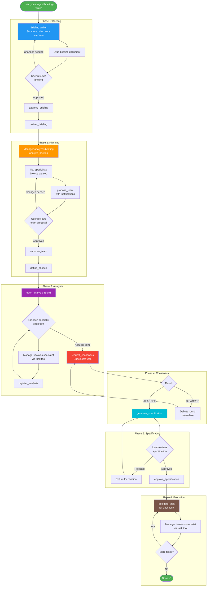
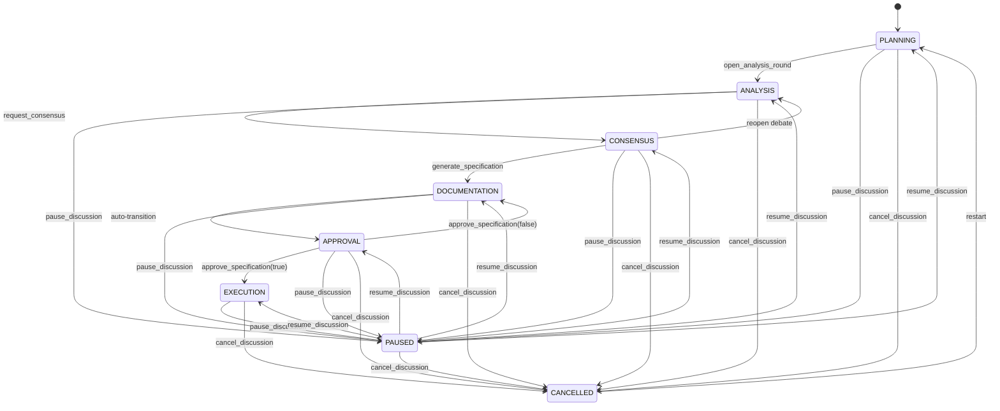
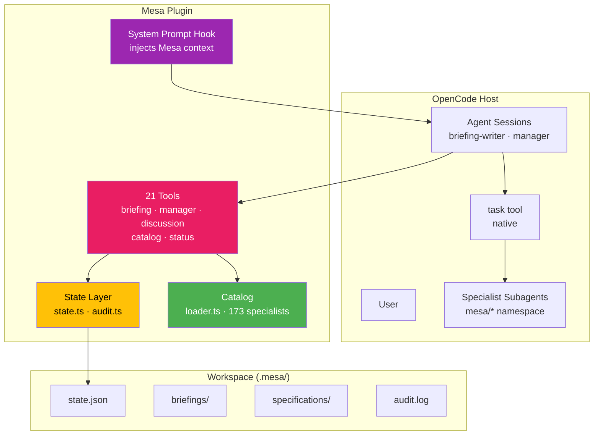

# Mesa

> Structured AI specialist discussions for OpenCode — produce high-quality specifications through multi-agent analysis, debate, and consensus.


## Why This Exists

Single-agent AI coding has a fundamental limitation: there's no peer review, no debate, no structured analysis. When one AI produces a specification, there's nobody to challenge assumptions, spot blind spots, or push back on weak ideas. The result is often a shallow, one-perspective document that looks complete but falls apart under scrutiny.

Mesa fixes this by orchestrating multiple AI specialists — each with distinct domain expertise — who analyze your project from different angles, debate their findings, and reach consensus before producing a specification. A backend architect sees things a security specialist misses; a product manager catches gaps an engineer overlooks.

Think of Mesa as a **round table** for AI agents: you bring the problem, Mesa assembles the right experts, and the structured workflow ensures every voice is heard before anything gets written down.

## How It Works



The workflow has six phases:

1. **Briefing** — The Briefing Writer agent conducts a structured discovery interview with you, drafts a briefing document, and waits for your approval.
2. **Planning** — The Manager agent analyzes your briefing, browses the specialist catalog, proposes a team with justifications, and waits for your approval.
3. **Analysis** — Each specialist analyzes the briefing from their unique perspective, across multiple turns. Analyses are registered and accumulated.
4. **Consensus** — Specialists vote on the combined analysis (AGREE / AGREE_WITH_RESERVATIONS / DISAGREE). If disagreements exist, a debate round follows until consensus is reached.
5. **Specification** — All specialist sections are compiled into a single Markdown document. You review and approve or reject it.
6. **Execution** — The Manager delegates implementation tasks to individual specialists.

Every phase transition requires **explicit human approval** — Mesa never proceeds without your say-so.

## Quick Start

```bash
# Install Mesa in under 2 minutes
curl -fsSL https://raw.githubusercontent.com/hacklabr/opencode-mesa/main/install.sh | bash
```

The script clones the repo, builds the plugin, generates specialist agents, and prints the plugin path to add to your `opencode.json`. Restart OpenCode, then start a discussion:

```
/agent briefing-writer
```

That's it. The Briefing Writer will guide you through discovery, and the workflow proceeds from there.

## Installation

### Quick Install

```bash
curl -fsSL https://raw.githubusercontent.com/hacklabr/opencode-mesa/main/install.sh | bash
```

This single command:

- Clones the repository to `~/.local/share/opencode-mesa`
- Installs dependencies and builds the plugin
- Generates 173 specialist subagents from the catalog
- Prints the plugin path for your `opencode.json`

### Manual Install

```bash
git clone https://github.com/hacklabr/opencode-mesa.git ~/.local/share/opencode-mesa
cd ~/.local/share/opencode-mesa
bun install && bun run build && bun run setup:agents
```

Then add to your project's `opencode.json`:

```json
{
  "plugin": ["file:///home/YOURUSER/.local/share/opencode-mesa/dist/index.js"]
}
```

### Custom Install Location

```bash
curl -fsSL https://raw.githubusercontent.com/hacklabr/opencode-mesa/main/install.sh | bash -s -- \
  https://github.com/hacklabr/opencode-mesa /path/to/install
```

### Verifying Installation

After restarting OpenCode, verify Mesa is loaded:

```
> mesa_status
```

You should see the plugin version, current phase (`PLANNING`), and empty counts for team, analyses, and votes.

## Usage

### Starting a Discussion (Briefing Phase)

Switch to the Briefing Writer agent and describe what you need:

```
/agent briefing-writer
```

The Briefing Writer conducts a structured discovery interview — asking about your project's goals, constraints, scope, and success criteria. When the interview is complete, it calls `create_briefing` to save the document, and waits for your approval via `approve_briefing`.

Once approved, `deliver_briefing` hands the briefing to the Manager agent and transitions to the **PLANNING** phase.

You can also import an existing document as a briefing (skips the interview):

```
> import_briefing(file_path="/path/to/my-briefing.md", slug="my-project", title="My Project")
```

### Team Proposal & Approval (Planning Phase)

The Manager agent reads the briefing via `analyze_briefing`, browses the specialist catalog with `list_specialists`, and proposes a team:

```
> propose_team(specialists=[
    { personaId: "engineering-backend-architect", name: "Backend Architect", division: "engineering", justification: "..." },
    { personaId: "security-specialist", name: "Security Specialist", division: "specialized", justification: "..." }
  ])
```

You review the proposal — if you approve, the Manager calls `summon_team` to mark specialists as ready, then `define_phases` to set the workflow phases.

### Analysis Rounds (Analysis Phase)

The Manager opens an analysis round:

```
> open_analysis_round(
    topic="API design for order management",
    participants=["engineering-backend-architect", "security-specialist"],
    max_turns=2,
    briefing_content="..."
  )
```

For each specialist, the Manager invokes them via OpenCode's native `task` tool:

```
task(subagent_type="mesa/engineering-backend-architect", prompt="Analyze the following...", description="Backend analysis")
```

After each specialist responds, the Manager registers their analysis:

```
> register_analysis(agent_id="engineering-backend-architect", agent_name="Backend Architect", content="...", turn=1)
```

### Consensus & Specification (Consensus + Documentation Phases)

Once all analyses are in, the Manager calls `request_consensus` with each specialist's vote:

```
> request_consensus(
    votes=[
      { agent_id: "engineering-backend-architect", agent_name: "Backend Architect", vote: 1, reason: "Agree with security findings" },
      { agent_id: "security-specialist", agent_name: "Security Specialist", vote: 2, reason: "Agree but recommend rate limiting" }
    ],
    round=1
  )
```

Votes: `0` = DISAGREE, `1` = AGREE, `2` = AGREE_WITH_RESERVATIONS.

If all agree, the Manager compiles the specification:

```
> generate_specification(
    sections=[
      { specialist_name: "Backend Architect", specialist_id: "engineering-backend-architect", content: "## Backend Recommendations\n\n..." },
      { specialist_name: "Security Specialist", specialist_id: "security-specialist", content: "## Security Analysis\n\n..." }
    ],
    topic="Order Management API"
  )
```

You review the generated spec, then approve or reject:

```
> approve_specification(approved=true)
> approve_specification(approved=false, feedback="Missing error handling section")
```

### Execution (Execution Phase)

After specification approval, the Manager delegates implementation tasks:

```
> delegate_task(
    personaId="engineering-backend-architect",
    task="Implement order management API endpoints",
    context_info="See specification section 2..."
  )
```

The tool returns instructions for invoking the specialist via the `task` tool.

## Workflow Reference

The state machine controls phase transitions. Every transition is validated — invalid transitions are rejected with a clear error message.



You can pause, resume, or cancel at any phase. Cancelling clears analysis data but preserves the briefing and team. You can restart from `CANCELLED` back to `PLANNING`.

## Architecture



Mesa is an OpenCode plugin that registers 21 tools, 173 specialist subagents, and a system prompt hook. The plugin itself manages state transitions and persistence — the actual specialist invocation happens through OpenCode's native `task` tool, which creates a real subagent session with the specialist's own system prompt.

Key design decisions:

- **Specialists are real subagents** — each runs in its own session with its own system prompt, not a simulated persona.
- **State is file-based** — everything lives in `.mesa/` within your workspace. No databases, no external services.
- **The Manager never generates content** — it orchestrates. Specialists generate the actual analysis and specification content.
- **Human approval gates** — team proposal, specification, and every phase transition can require explicit human confirmation.

## Tool Reference

Mesa provides 21 tools organized into five categories.

### General Tools

| Tool | Description | Parameters |
|------|-------------|------------|
| `mesa_status` | Returns the current plugin status, phase, and counts | _(none)_ |

### Catalog Tools

| Tool | Description | Parameters |
|------|-------------|------------|
| `list_specialists` | Lists available specialist personas from the catalog | `division?` `string` — filter by division name (e.g. `'engineering'`, `'product'`) · `search?` `string` — search term to filter by name or description |
| `get_specialist` | Returns full details and system prompt of a specialist | `id` `string` — the persona ID (e.g. `'engineering-backend-architect'`) |

### Briefing Tools

| Tool | Description | Parameters |
|------|-------------|------------|
| `create_briefing` | Creates and saves a new briefing document in `.mesa/briefings/` | `slug` `string` — URL-friendly identifier (e.g. `'ecommerce-platform'`) · `title` `string` — the briefing title · `content` `string` — full briefing content in Markdown |
| `approve_briefing` | Marks the current briefing as approved (requires human confirmation) | _(none)_ |
| `deliver_briefing` | Delivers the approved briefing to the Manager, transitions to PLANNING | _(none)_ |
| `import_briefing` | Imports an existing file as a pre-approved briefing, resets to PLANNING | `file_path` `string` — absolute path to the briefing file · `slug` `string` — URL-friendly identifier · `title?` `string` — title (defaults to filename) |

### Manager Tools

| Tool | Description | Parameters |
|------|-------------|------------|
| `analyze_briefing` | Reads the current approved briefing for analysis (PLANNING phase only) | _(none)_ |
| `propose_team` | Proposes a team of specialists with justifications for human approval | `specialists` `array<{ personaId: string, name: string, division: string, justification: string }>` — proposed specialists |
| `summon_team` | Summons the approved team, marking each specialist as ready | _(none)_ |
| `delegate_task` | Defines a task for a specialist, returns invocation instructions (EXECUTION phase only) | `personaId` `string` — specialist persona ID · `task` `string` — task description · `context_info?` `string` — additional context |
| `define_phases` | Defines the ordered workflow phases for the current project | `phases` `array<string>` — ordered phase names (e.g. `['PLANNING', 'ANALYSIS', 'CONSENSUS']`) |

### Discussion Tools

| Tool | Description | Parameters |
|------|-------------|------------|
| `open_analysis_round` | Opens a structured analysis round with topic and participants (PLANNING → ANALYSIS) | `topic` `string` — the discussion topic · `participants` `array<string>` — ordered specialist persona IDs · `max_turns?` `number` — max turns per specialist (default: 2) · `briefing_content?` `string` — briefing content for specialists |
| `register_analysis` | Registers a specialist's analysis in the current round (ANALYSIS phase only) | `agent_id` `string` — specialist persona ID · `agent_name` `string` — specialist display name · `content` `string` — the analysis content · `turn` `number` — current turn number (1-based) |
| `request_consensus` | Initiates consensus voting (ANALYSIS → CONSENSUS) | `votes` `array<{ agent_id: string, agent_name: string, vote: 0\|1\|2, reason: string }>` — specialist votes (0=DISAGREE, 1=AGREE, 2=AGREE_WITH_RESERVATIONS) · `round` `number` — consensus round number |
| `generate_specification` | Compiles specialist analyses into a specification document (CONSENSUS → DOCUMENTATION → APPROVAL) | `sections` `array<{ specialist_name: string, specialist_id: string, content: string }>` — specification sections · `topic` `string` — specification topic/title |
| `approve_specification` | Approves or rejects the specification (APPROVAL → EXECUTION or → DOCUMENTATION) | `approved` `boolean` — whether approved · `feedback?` `string` — optional rejection reason |
| `pause_discussion` | Pauses the current discussion, preserving state for later resumption | _(none)_ |
| `resume_discussion` | Resumes a paused discussion to a specified phase | `target_phase` `string` — phase to resume to (e.g. `'ANALYSIS'`, `'CONSENSUS'`) |
| `cancel_discussion` | Cancels the discussion and clears analysis data | _(none)_ |

## State Persistence

All discussion state is stored in `.mesa/` within your workspace:

```
.mesa/
├── state.json                 # Current discussion state (phase, team, analyses, votes)
├── briefing-current.md        # Active briefing (delivered to Manager)
├── briefings/                 # Saved briefing documents
│   └── briefing-{slug}.md
├── specifications/            # Generated specification documents
│   └── spec-{id}.md
├── briefing-for-discussion.md # Briefing content passed to specialists
└── audit.log                  # Action audit trail
```

State is managed through strict phase transitions — every tool validates the current phase before executing. Invalid transitions are rejected with a descriptive error. The audit log records every significant action (briefing approved, team summoned, consensus reached, etc.) for traceability.

## Agents

### Primary Agents

| Agent | Description |
|-------|-------------|
| `briefing-writer` | Conducts structured discovery sessions to produce professional briefings |
| `manager` | Orchestrates specialist teams for structured discussion and specification |

### Specialist Subagents

173 specialists from the [agency-agents](https://github.com/msitarzewski/agency-agents) catalog, organized in 16+ divisions:

- academic, design, engineering, finance, game-development
- integrations, marketing, paid-media, product, project-management
- sales, spatial-computing, specialized, strategy, support, testing

Each specialist is registered as a hidden subagent in the `mesa/` namespace with `mode: subagent` and their own system prompt. OpenCode automatically injects the specialist's system prompt when invoked — the Manager must NOT include it in the task prompt.

The Manager invokes specialists via:

```
task(subagent_type="mesa/engineering-backend-architect", prompt="<task details only>", description="...")
```

To regenerate after catalog changes:

```bash
bun run setup:agents
```

## Development

```bash
bun install            # Install dependencies
bun run build          # Build the plugin (tsc + copy catalog)
bun run lint           # Type-check without emitting
bun run typecheck      # Type-check without emitting
bun test               # Run test suite (vitest)
bun run dev            # Watch mode (tsc --watch)
bun run setup:agents   # Generate .opencode/agents/ from catalog
```

**Prerequisites**: [Bun](https://bun.sh/) runtime, TypeScript 5+

## Contributing

Contributions are welcome. Please follow the conventions in `AGENTS.md`:

- Code in English (variables, functions, types, comments)
- Commits: concise, imperative present (`feat: add catalog loader`, `fix: handle missing frontmatter`)
- Run `bun run lint` and `bun run typecheck` before every commit
- Every new feature must include tests

See [AGENTS.md](AGENTS.md) for the full contribution guidelines.

## License

[MIT](LICENSE) © [HackLab](https://github.com/hacklabr)

The specialist catalog is sourced from [agency-agents](https://github.com/msitarzewski/agency-agents) — see its license for catalog usage terms.
