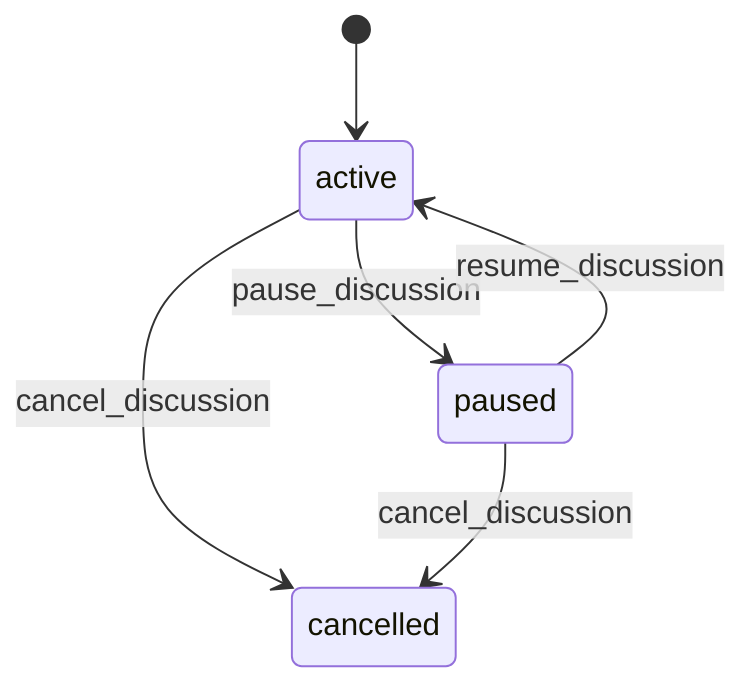
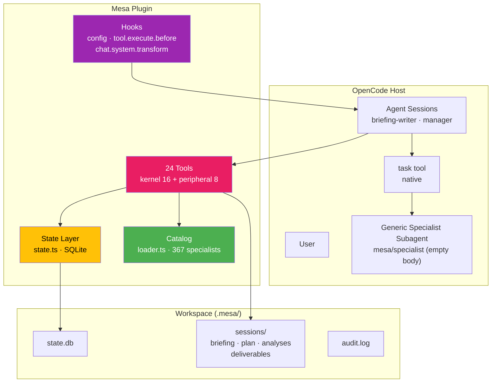

# Mesa

> Structured AI specialist discussions for OpenCode — produce high-quality specifications through multi-agent analysis, debate, and consensus.


## Why This Exists

Single-agent AI coding has a fundamental limitation: there's no peer review, no debate, no structured analysis. When one AI produces a specification, there's nobody to challenge assumptions, spot blind spots, or push back on weak ideas. The result is often a shallow, one-perspective document that looks complete but falls apart under scrutiny.

Mesa fixes this by orchestrating multiple AI specialists — each with distinct domain expertise — who analyze your project from different angles, debate their findings, and reach consensus before producing a specification. A backend architect sees things a security specialist misses; a product manager catches gaps an engineer overlooks.

Think of Mesa as a **round table** for AI agents: you bring the problem, Mesa assembles the right experts, and the structured workflow ensures every voice is heard before anything gets written down.

## How It Works

Mesa is an **adaptive orchestrator**, not a fixed pipeline. The Manager reads your briefing, **designs a workflow tailored to your scope**, gets it approved, and executes it using one universal primitive — the **discussion round** — composing parallel/sequential rounds with variable casts.

```mermaid
flowchart TD
    Start([User types /agent briefing-writer]) --> Briefing

    subgraph "Briefing"
        Briefing[Briefing Writer\nstructured discovery] --> BReview{User reviews}
        BReview -->|Changes| Briefing
        BReview -->|Approved| BApprove[approve_briefing]
    end

    BApprove --> Team

    subgraph "Team"
        Team[Manager browses catalog\nlist_specialists] --> Propose[propose_team]
        Propose --> TReview{User reviews}
        TReview -->|Changes| Propose
        TReview -->|Approved| Summon[summon_team]
    end

    Summon --> Plan

    subgraph "Workflow Plan — Gate 0"
        Plan[Manager writes\nworkflow-plan.md] --> PReview{User approves plan}
        PReview -->|Changes| Plan
        PReview -->|Approved| Gate0["record_decision(type='gate', target='plan')"]
    end

    Gate0 --> Rounds

    subgraph "Rounds — the universal primitive"
        Rounds[open_round\ntopic + participants ⊆ team] --> Analyses[register_analysis × N\nPOSITION: agree / agree-with-reservations / disagree]
        Analyses --> Close{close_round}
        Close -->|disagree| Subset[subset round\nwith dissenters]
        Subset --> Analyses
        Close -->|converged / open-tensions| Next{More rounds\nin plan?}
        Next -->|Yes| Rounds
    end

    Next -->|No| Deliverable

    subgraph "Deliverable"
        Deliverable[produce_deliverable] --> DReview{User reviews}
        DReview -->|Rejected| Deliverable
        DReview -->|Approved| DApprove[approve_deliverable]
    end

    DApprove --> Done([Done])

    style Start fill:#4CAF50,color:#fff
    style Done fill:#4CAF50,color:#fff
    style Briefing fill:#2196F3,color:#fff
    style Team fill:#FF9800,color:#fff
    style Plan fill:#9C27B0,color:#fff
    style Rounds fill:#F44336,color:#fff
    style Deliverable fill:#00BCD4,color:#fff
```

The flow:

1. **Briefing** — The Briefing Writer conducts a structured discovery interview, drafts a briefing document, and waits for your approval. Approval is a fact, not a phase — `approve_briefing` is the only path to an approved briefing.
2. **Team** — The Manager browses the specialist catalog, proposes a team with justifications, and waits for your approval (`summon_team`).
3. **Workflow plan (gate 0)** — The Manager writes `workflow-plan.md`: deliverable, scope class, planned rounds, gates, and an explicit `Skipped:` line for every optional step. You approve the document; the Manager records it via `record_decision`. No round can open without an approved plan.
4. **Rounds** — For each round, `open_round` sets the topic and cast (a subset of the team). Specialists analyze and self-register their work, ending with a declared `POSITION:` block. `close_round` records the outcome: `converged`, `converged-with-open-tensions` (tensions copied verbatim), or `escalated` (you judge). A declared `disagree` vetoes "converged" — the Manager opens a subset round with the dissenters.
5. **Deliverable** — `produce_deliverable` writes the canonical artifact (specification, overview, journeys, appendix, …) with round provenance. You approve it via `approve_deliverable`.

Every approval gate — briefing, team, plan, deliverable — requires **explicit human approval recorded through a tool**. Verbal approval in chat is never sufficient.

Consensus is **emergent**: specialists declare positions; the Manager judges whether the *process* converged, never who is *right*. There is no structured voting.

## Quick Start

```bash
# Install Mesa in under 2 minutes
curl -fsSL https://raw.githubusercontent.com/hacklabr/opencode-mesa/main/install.sh | bash
```

The script clones the repo, builds the plugin, generates the Mesa agents, and prints the plugin path to add to your `opencode.json`. Restart OpenCode, then start a discussion:

```
/agent briefing-writer
```

That's it. The Briefing Writer will guide you through discovery, and the workflow proceeds from there.

## Installation

### Quick Install

```bash
curl -fsSL https://raw.githubusercontent.com/hacklabr/opencode-mesa/main/install.sh | bash
```

This single command:

- Clones the repository to `~/.local/share/opencode-mesa`
- Installs dependencies and builds the plugin
- Generates the Mesa agents (`briefing-writer`, `manager`, and the generic `mesa/specialist` subagent)
- Prints the plugin path for your `opencode.json`

### Manual Install

```bash
git clone https://github.com/hacklabr/opencode-mesa.git ~/.local/share/opencode-mesa
cd ~/.local/share/opencode-mesa
bun install && bun run build && bun run setup:agents
```

Then add to your project's `opencode.json`:

```json
{
  "plugin": ["file:///home/YOURUSER/.local/share/opencode-mesa/dist/index.js"]
}
```

### Custom Install Location

```bash
curl -fsSL https://raw.githubusercontent.com/hacklabr/opencode-mesa/main/install.sh | bash -s -- \
  https://github.com/hacklabr/opencode-mesa /path/to/install
```

### Verifying Installation

After restarting OpenCode, verify Mesa is loaded:

```
> mesa_status
```

You should see the plugin version and the current session summary (briefing, team, plan, rounds, deliverables).

### Uninstall

```bash
curl -fsSL https://raw.githubusercontent.com/hacklabr/opencode-mesa/main/uninstall.sh | bash
```

Removes the Mesa agents (`briefing-writer`, `manager`, `mesa/specialist`), the plugin entry from `opencode.json`, and the clone at `~/.local/share/opencode-mesa`. Your `opencode.json` is preserved otherwise.

## Usage

### Briefing

Switch to the Briefing Writer agent and describe what you need:

```
/agent briefing-writer
```

The Briefing Writer conducts a structured discovery interview — goals, constraints, scope, success criteria. When complete, it calls `create_briefing` to save the document, and waits for your approval via `approve_briefing`. Approval also hands the briefing to the Manager — switch agents manually:

```
/agent manager
```

You can also import an existing document as a briefing (skips the interview):

```
> import_briefing(file_path="/path/to/my-briefing.md", slug="my-project", title="My Project")
```

### Team

The Manager browses the catalog with `list_specialists` / `get_specialist` and proposes a team:

```
> propose_team(specialists=[
    { personaId: "engineering-backend-architect", name: "Backend Architect", division: "engineering", justification: "..." },
    { personaId: "security-specialist", name: "Security Specialist", division: "specialized", justification: "..." }
  ])
```

If you approve, the Manager calls `summon_team`. Only summoned team members can participate in rounds.

### Workflow Plan (Gate 0)

Before the first round, the Manager writes `workflow-plan.md` in the session folder and presents it to you. On your approval:

```
> record_decision(type="gate", target="plan",
    reason="Human approved workflow plan v1",
    payload={path: ".mesa/sessions/<id>/workflow-plan.md"})
```

Mid-flight changes require a new file version plus `record_decision(type="plan-amendment", ...)` — silent replanning is detectable and forbidden.

### Rounds

```
> open_round(topic="API design for order management",
    participants=["engineering-backend-architect", "security-specialist"])
```

The Manager invokes each participant via OpenCode's native `task` tool against the generic `mesa/specialist` subagent. Each specialist self-registers from its own session:

```
> register_analysis(agent_id="engineering-backend-architect", agent_name="Backend Architect", content="...", turn=1)
```

Every participant's final artifact ends with a declared position:

```
POSITION: agree | agree-with-reservations | disagree — [reason]
```

### Closing a Round

```
> close_round(
    decision="converged-with-open-tensions",
    summary="...",
    tensions=["Rate limiting strategy unresolved — Security Specialist"],
    evidencePaths=[".mesa/sessions/<id>/analyses/turn1/security-specialist.md", ...]
  )
```

- A declared `disagree` **vetoes `converged`** — open a subset round with the dissenters, record the tension verbatim, or escalate to the human.
- `evidencePaths[]` is mandatory — decisions without cited evidence are rubber-stamping.
- Analyses registered by the Manager on a specialist's behalf never satisfy the position requirement.

### Deliverables

```
> produce_deliverable(kind="specification", topic="Order Management API", content="...")
> approve_deliverable(path=".mesa/sessions/<id>/specification.md", approved=true)
```

Kinds: `specification`, `overview`, `journeys`, `appendix`, `other`. Approved deliverables are immutable; each records the rounds it derives from.

## Session Lifecycle

The session has a single status — `active`, `paused`, or `cancelled`. All mutating tools require `active`.


```mermaid
stateDiagram-v2
    [*] --> active
    active --> paused : pause_discussion
    paused --> active : resume_discussion
    active --> cancelled : cancel_discussion
    paused --> cancelled : cancel_discussion
```

Cancelling clears analysis data but preserves the briefing, team, and deliverables. On resume, the Manager re-reads the plan and round trace and declares its position before acting.

## Architecture


```mermaid
graph TB
    subgraph "OpenCode Host"
        User[User]
        Agents[Agent Sessions\nbriefing-writer · manager]
        TaskTool[task tool\nnative]
        SubAgents["Generic Specialist Subagent\nmesa/specialist (empty body)"]
    end

    subgraph "Mesa Plugin"
        Tools["24 Tools\nkernel 16 + peripheral 8"]
        State["State Layer\nstate.ts · SQLite"]
        Catalog["Catalog\nloader.ts · 367 specialists"]
        Hooks["Hooks\nconfig · tool.execute.before\nchat.system.transform"]
    end

    subgraph "Workspace (.mesa/)"
        Db[state.db]
        Sessions["sessions/\nbriefing · plan · analyses\ndeliverables"]
        AuditFile[audit.log]
    end

    Tools --> State --> Db
    Tools --> Sessions
    Tools --> Catalog
    Hooks --> Agents
    Agents --> Tools
    Agents --> TaskTool --> SubAgents

    style Tools fill:#E91E63,color:#fff
    style State fill:#FFC107,color:#000
    style Catalog fill:#4CAF50,color:#fff
    style Hooks fill:#9C27B0,color:#fff
```

Mesa is an OpenCode plugin that registers 24 tools, a 367-persona specialist catalog, and three hooks. The plugin manages seams — cross-session capture, artifact integrity, human gates, circuit breakers, audit — while the workflow itself lives in the Manager's prompt. Specialist invocation happens through OpenCode's native `task` tool.

Key design decisions:

- **Kernel/shell model** — code keeps only what is a seam (K1–K5): cross-session capture, artifact integrity, human approval gates, circuit breakers, tamper-evident audit. Workflow topology, consensus format, and rigor live in the prompt.
- **Data preconditions, not phases** — guards check that required artifacts exist and are approved, never that the session sits at a pipeline position. Every error message teaches recovery.
- **Specialists are real subagents** — each runs in its own session with its own system prompt, injected at delegation time.
- **Emergent consensus** — specialists declare POSITION blocks; the Manager tabulates process state, never infers positions or judges content merit.
- **The plan is the contract** — intention (`workflow-plan.md`), fact (state pointer), trace (`rounds[]`). Amendments bump the version with an audited reason.
- **Tool visibility filtering** — specialist sessions receive only their 7-tool seam; denied tools are removed from the LLM payload, saving ~5.3k tokens per specialist session.

See [docs/architecture.md](docs/architecture.md) for the full reference.

## Tool Reference

Mesa provides 24 tools: a 16-tool workflow kernel plus 8 peripherals.

### Kernel

| Tool | Description |
|------|-------------|
| `mesa_status` | Plugin status, session summary, and plan-gate instruction |
| `list_specialists` | List specialist personas (`division?`, `search?` filters) |
| `get_specialist` | Full details and system prompt of a persona (`id`) |
| `create_briefing` | Create a briefing document (`slug`, `title`, `content`) |
| `import_briefing` | Import an existing file as a briefing (`file_path`, `slug`, `title?`) |
| `approve_briefing` | Approve the briefing and hand it to the Manager — the only path to approved |
| `propose_team` | Propose a team with justifications for human approval |
| `summon_team` | Summon the approved team |
| `open_round` | Open a discussion round (`topic`, `participants` ⊆ team, `briefing_content?`) |
| `register_analysis` | Register a specialist's analysis in the open round (`agent_id`, `agent_name`, `content`, `turn`, `file_path?`, `kind?`, `turn_type?`) |
| `get_peer_analyses` | List analysis file paths and metadata (read-only) |
| `close_round` | Close the open round with an audited outcome (`decision`, `summary`, `tensions`, `evidencePaths`, `humanOverride?`) |
| `record_decision` | Record an audited decision — plan gate, amendments, overrides, delegations, notes (`type`, `target?`, `reason`, `payload?`) |
| `produce_deliverable` | Produce a canonical deliverable in the session folder (`kind`, `topic`, `content`, `humanOverride?`) |
| `approve_deliverable` | Approve or reject a deliverable — the only path to approved (`path`, `approved`, `feedback?`) |
| `ask_peer` | Ask a peer specialist a direct question with full session context |

### Peripherals

| Tool | Description |
|------|-------------|
| `pause_discussion` | Pause the session; state preserved |
| `resume_discussion` | Resume a paused session |
| `cancel_discussion` | Cancel the session; clears analyses, preserves briefing/team/deliverables |
| `memory_store` | Store a cross-session memory entry (deduplicated) |
| `memory_recall` | Recall project memories by category/query |
| `memory_forget` | Soft-delete a memory entry |
| `mesa_check_update` | Check for a newer plugin version |
| `mesa_update` | Update the plugin (requires restart) |

## State Persistence

All session state lives in `.mesa/` within your workspace:

```
.mesa/
├── state.db                    # SQLite state (v15): briefing, team, rounds, deliverables, plan
├── audit.log                   # Tamper-evident action trail
└── sessions/
    └── {timestamp}_{id}_{slug}/
        ├── briefing.md
        ├── workflow-plan.md    # The approved plan (gate 0)
        ├── analyses/           # Per-turn analysis files
        ├── specification.md    # + overview.md, appendices/, deliverables/
        └── ...
```

Integrity is protected by data preconditions, not a phase state machine — every tool validates that the artifacts it depends on exist and are approved. The audit log records every significant action with the current plan version.

## Agents

### Primary Agents

| Agent | Description |
|-------|-------------|
| `briefing-writer` | Conducts structured discovery sessions to produce professional briefings |
| `manager` | Designs the workflow plan and orchestrates specialist rounds |

### Specialist Subagent

All 367 personas from the [agency-agents](https://github.com/msitarzewski/agency-agents) catalog run through a single generic hidden subagent, `mesa/specialist`, registered with `mode: subagent` and an intentionally empty body. At delegation time the plugin resolves the persona (via the `tool.execute.before` hook):

1. **Inline persona block (primary)** — the Manager includes `<specialist-persona id="...">...</specialist-persona>` in the task prompt. Required on runtimes that reject non-`ses_` task IDs.
2. **`task_id` slug** — `task_id="mesa-{personaId}"`; the hook injects the persona from the catalog. A stable `task_id` preserves specialist memory across rounds.

Specialist sessions see only their seam tools (`register_analysis`, `get_peer_analyses`, `ask_peer`, memory tools, `mesa_status`) — everything else is filtered out of the request payload.

To regenerate the agent files after plugin updates:

```bash
bun run setup:agents
```

## Development

```bash
bun install            # Install dependencies
bun run build          # Build the plugin (tsc + copy catalog)
bun run lint           # Type-check without emitting
bun run typecheck      # Type-check without emitting
bun test               # Run test suite (vitest)
bun run dev            # Watch mode (tsc --watch)
bun run setup:agents   # Generate .opencode/agents/ (briefing-writer, manager, mesa/specialist)
```

**Prerequisites**: [Bun](https://bun.sh/) runtime, TypeScript 5+

## Contributing

Contributions are welcome. Please follow the conventions in `AGENTS.md`:

- Code in English (variables, functions, types, comments)
- Commits: concise, imperative present (`feat: add catalog loader`, `fix: handle missing frontmatter`)
- Run `bun run lint` and `bun run typecheck` before every commit
- Every new feature must include tests

See [AGENTS.md](AGENTS.md) for the full contribution guidelines.

## License

[MIT](LICENSE) © [HackLab](https://github.com/hacklabr)

The specialist catalog is sourced from [agency-agents](https://github.com/msitarzewski/agency-agents) — see its license for catalog usage terms.
