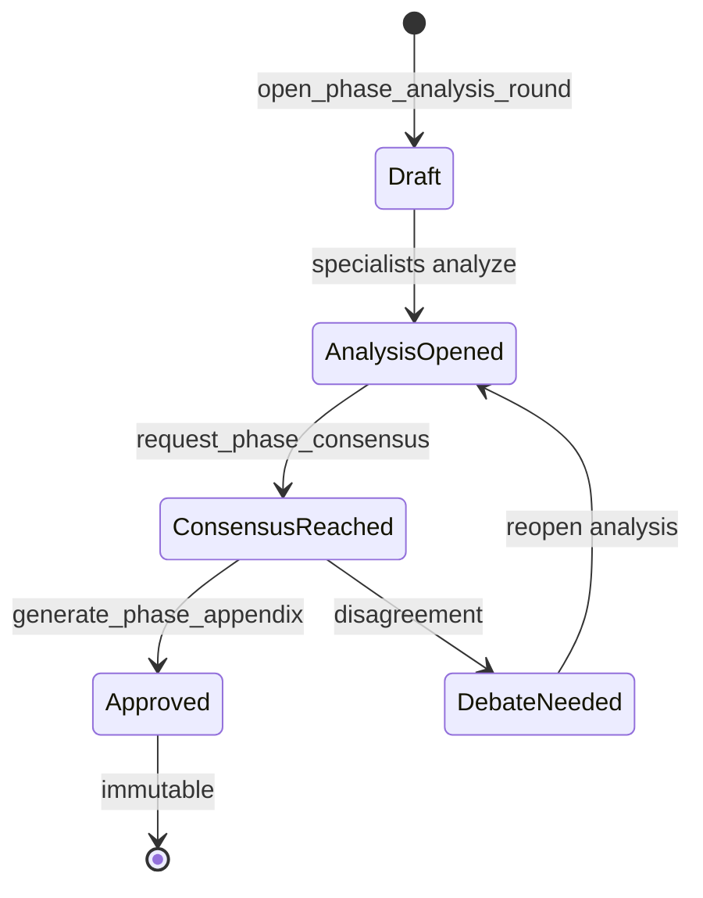

# Phase Appendices Reference

Reference documentation for Mesa phase appendices — what they are, how they are structured, and how they relate to the master specification.

> **Diátaxis category**: Reference

## What is a Phase Appendix

A **phase appendix** is an authoritative specification document produced by the iterative phase analysis workflow. It supersedes the master specification for exactly one execution phase.

When a master specification contains an execution plan with multiple phases, Mesa can open a structured analysis round for any phase that warrants deeper exploration. The output of that round is a phase appendix: a self-contained document with its own specialist analyses, consensus outcome, technical decisions, and a revised execution plan scoped to that phase.

### Override Semantics

Each appendix carries an explicit override rule:

> **This document supersedes the master specification for Phase N only.**

This means:

- The appendix is the **authoritative source** for implementers working on that phase.
- The master specification remains valid for all **other** phases.
- `delegate_task` automatically resolves the appendix for a phase and injects it into the specialist's context.

If multiple appendices exist for the same phase (an edge case prevented by the workflow), the one referenced in `state.appendices` takes precedence.

## File Naming Conventions

### Canonical Appendices

After approval, appendices live in `.mesa/specifications/appendices/`:

```
.mesa/specifications/appendices/appendix-{master-id}-{phase-slug}-{short-uuid}.md
```

| Segment | Description | Example |
|---------|-------------|---------|
| `master-id` | Master spec filename without prefix/suffix | `910a7363` from `spec-910a7363.md` |
| `phase-slug` | URL-friendly phase name | `foundation`, `core-tools` |
| `short-uuid` | First 8 chars of a random UUID | `a3f7e2b1` |

Example:
```
appendix-910a7363-foundation-a3f7e2b1.md
```

### Draft Directories

During analysis and consensus, draft artifacts are written to:

```
.mesa/phase-analysis/phase-{index}-{phase-slug}/
```

Contents may include:

| File | Purpose |
|------|---------|
| `mini-briefing.md` | Human observations and answers from guided mode |
| `analysis-{agent-id}-{turn}.md` | Individual specialist analysis drafts |
| `consensus-votes.json` | Vote records before promotion |

Drafts are **not** authoritative. They are promoted to canonical appendices only via `generate_phase_appendix`.

### Analyses Directory

When an appendix is generated, a companion directory stores per-specialist analysis files:

```
.mesa/specifications/appendices/analyses-{master-id}-{phase-slug}-{short-uuid}/
```

## Frontmatter Schema Reference

Every appendix MUST include YAML frontmatter with the following fields:

```yaml
---
title: "Phase Appendix: Foundation"
master_spec: "spec-910a7363.md"
phase_slug: "foundation"
phase_index: 1
appendix_id: "app-a3f7e2b1"
generated_at: "2026-06-09T12:00:00.000Z"
mode: "observed"
specialists:
  - "engineering-backend-architect"
  - "security-specialist"
status: "approved"
---
```

### Field Definitions

| Field | Type | Required | Description |
|-------|------|----------|-------------|
| `title` | string | Yes | Human-readable title including phase name |
| `master_spec` | string | Yes | Filename of the parent master specification |
| `phase_slug` | string | Yes | URL-friendly phase identifier |
| `phase_index` | integer | Yes | 1-based position in the execution plan |
| `appendix_id` | string | Yes | Unique appendix identifier (`app-{short-uuid}`) |
| `generated_at` | ISO-8601 | Yes | Timestamp of generation |
| `mode` | `"observed"` \| `"auto"` | Yes | How the phase analysis was conducted |
| `specialists` | string[] | Yes | Persona IDs of specialists who contributed |
| `status` | `"draft"` \| `"approved"` | Yes | Current lifecycle status |

> **Warning**: The `status` field in the frontmatter is advisory. The ground truth for whether an appendix is active is its presence in `state.appendices` and the phase context sidecar status.

## Template Structure (Mandatory Sections)

Every appendix MUST contain the following sections in order:

```markdown
# Phase Appendix: {Phase Name}

**Override Rule:** This document supersedes the master specification for Phase {N} only.

## Phase Scope

What this phase covers and what it explicitly excludes.

## Mini-Discovery Context

*Present only when `mode: observed`.*

Human observations, answers to guided questions, and any free-form context captured before the analysis round opened.

## Specialist Analyses Summary

Condensed synthesis of all specialist analyses. Not a verbatim copy — a structured summary organized by theme or concern.

## Consensus Outcome

The result of the consensus vote: what specialists agreed on, what reservations were raised, and how disagreements were resolved.

## Technical Decisions

Concrete decisions made during the analysis, with rationale and trade-offs. Use tables for comparing options.

## Revised Execution Plan

The execution plan for this phase only, incorporating lessons from the analysis. Should be granular enough to delegate as tasks.

## Delta from Master Spec

**Mandatory.** A precise diff describing what changed between the master specification and this appendix. Implementers must know exactly what changed.

Example format:
```markdown
| Aspect | Master Spec | Appendix | Rationale |
|--------|-------------|----------|-----------|
| Database choice | PostgreSQL | PostgreSQL + read replicas | Scalability concern raised by backend architect |
| Auth approach | JWT | Session + CSRF | Security specialist reservation on token revocation |
| Deployment order | Backend first | Frontend first | Reduces integration risk |
```
```

> **Note**: The `Delta from Master Spec` section is the most important section for implementers. If nothing changed, explicitly state: "No material changes from the master specification."

## How to Read a Master Spec with Appendices

### For Implementers

1. Read the master specification first to understand the overall project context.
2. Identify the phase you are implementing.
3. Check `state.appendices` or scan `.mesa/specifications/appendices/` for a matching appendix.
4. If an appendix exists, treat it as the **authoritative** specification for that phase.
5. Cross-reference the appendix's `Delta from Master Spec` to understand deviations.

### For the Manager Agent

When delegating a task, the Manager should:

1. Call `delegate_task` with `phase_name` set to the target phase.
2. The tool automatically resolves the appendix and prepends it to the specialist's context.
3. The specialist receives a context header like:
   ```
   **Phase Appendix (authoritative for "Foundation"):** .mesa/specifications/appendices/appendix-910a7363-foundation-a3f7e2b1.md
   ```

### Programmatic Access

Appendices are indexed in the `DiscussionState.appendices` array:

```typescript
const state = await loadState(workspaceDir);
for (const appendixRef of state.appendices) {
  const path = join(workspaceDir, ".mesa", "specifications", "appendices", appendixRef);
  // Read and parse the appendix
}
```

## Lifecycle States

An appendix progresses through the following states:



| State | Location | Mutability |
|-------|----------|------------|
| Draft | `.mesa/phase-analysis/` | Mutable |
| Analysis Opened | Sidecar + draft dir | Mutable |
| Consensus Reached | Sidecar + draft dir | Mutable |
| Approved | `.mesa/specifications/appendices/` | **Immutable** |

> **Warning**: Once an appendix is approved and written to the canonical path, it MUST NOT be modified. If errors are discovered, generate a new appendix with a new UUID. Immutability ensures auditability and prevents spec drift.

## See Also

- [Workflow Reference](workflow.md) — Iterative phase analysis workflow
- [Architecture Reference](architecture.md) — Sidecar pattern and file layout
- `src/tools/phase-analysis-tools.ts` — Tool implementations
- `src/utils/phase-detection.ts` — Phase detection heuristics
