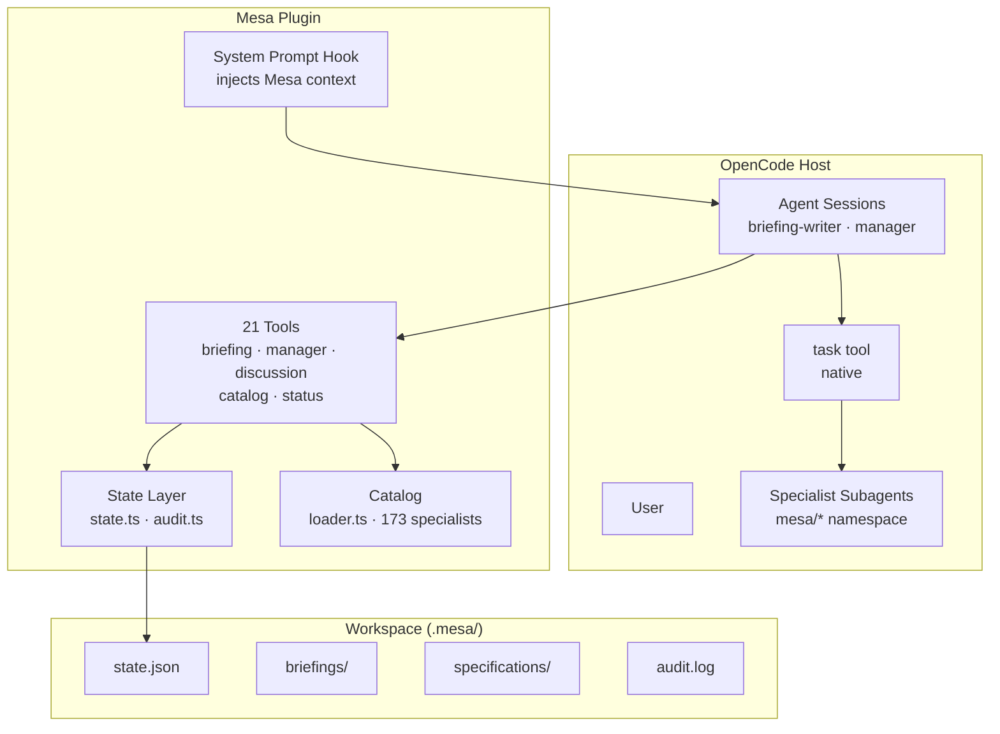
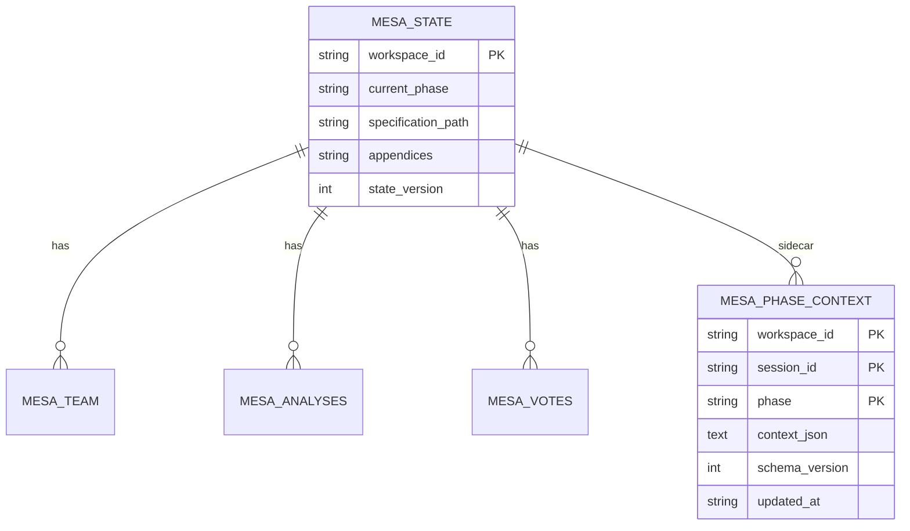
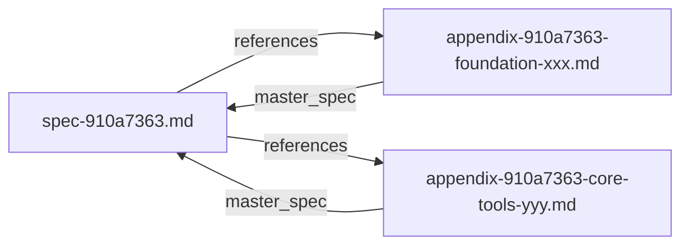
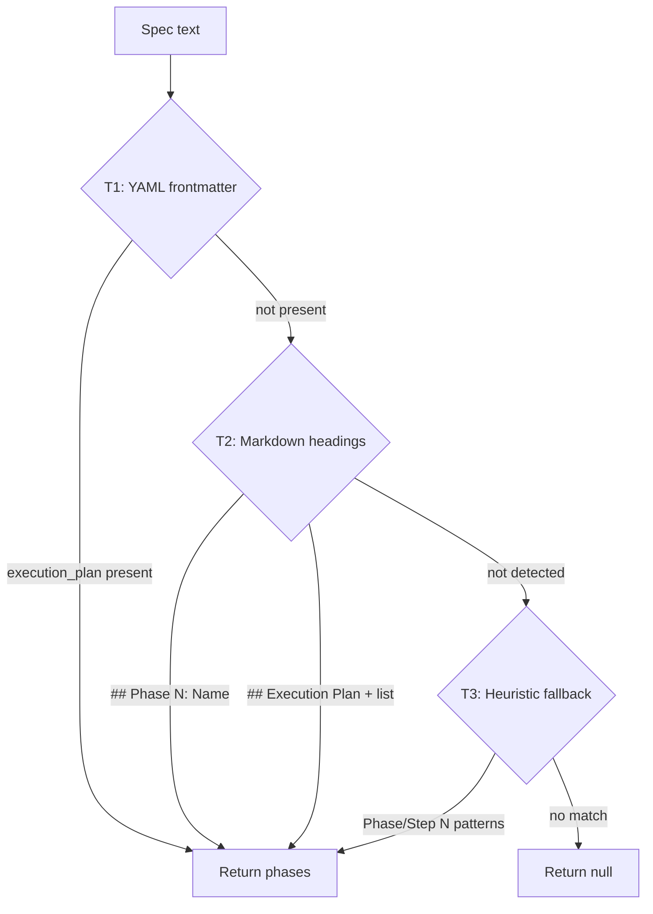

# Architecture Reference

Technical architecture of the Mesa plugin — components, data flow, and design decisions.

## Component Overview



## Module Descriptions

### Tools (`src/tools/`)

Five tool modules, each registering tools via the `tool()` helper from `@opencode-ai/plugin`:

| Module | Tools | Purpose |
|--------|-------|---------|
| `mesa-tools.ts` | `mesa_status` | Plugin health and state summary |
| `catalog-tools.ts` | `list_specialists`, `get_specialist` | Browse and retrieve specialist profiles |
| `briefing-tools.ts` | `create_briefing`, `approve_briefing`, `deliver_briefing`, `import_briefing` | Briefing lifecycle management |
| `manager-tools.ts` | `analyze_briefing`, `propose_team`, `summon_team`, `delegate_task`, `define_phases` | Team assembly and task delegation |
| `discussion-tools.ts` | `open_analysis_round`, `register_analysis`, `request_consensus`, `generate_specification`, `approve_specification`, `pause_discussion`, `resume_discussion`, `cancel_discussion` | Structured discussion workflow |

### State (`src/state.ts`, `src/audit.ts`)

**State management** follows a strict load → mutate → save pattern:

1. **Load**: `loadState()` reads `.mesa/state.json`. If corrupted, falls back to `.mesa/state.json.bak`. If neither exists, returns initial state.
2. **Mutate**: The tool handler modifies the state object in memory.
3. **Save**: `saveState()` writes to `.mesa/state.json.tmp`, then atomically renames to `.mesa/state.json`. The previous file is preserved as `.mesa/state.json.bak`.

**Atomic writes** ensure no data loss on crash:
- Write to `.tmp` file
- `rename()` (atomic on POSIX) to final path
- Previous state preserved as `.bak`

**Audit trail**: Every significant action (briefing approved, team summoned, analysis registered, etc.) is appended to `.mesa/audit.log` with a timestamp.

**Schema versioning**: State includes a `stateVersion` field. Future migrations check this field and apply transformations as needed.

### Catalog (`src/catalog/`)

The specialist catalog is loaded from embedded YAML files in `src/catalog/agency-agents/`:

1. **Loader** (`loader.ts`): Reads all `.md` files from the catalog directory, parses YAML frontmatter (delimited by `---`), and extracts specialist metadata (name, description, division, system prompt).
2. **Frontmatter parser**: Simple regex-based parser that extracts YAML key-value pairs between `---` delimiters.
3. **Caching**: The catalog is loaded once and cached in memory for the plugin's lifetime. Subsequent `list_specialists` and `get_specialist` calls read from cache.

Each specialist has:
- `id`: URL-friendly identifier (e.g. `engineering-backend-architect`)
- `name`: Display name
- `description`: Short description
- `division`: Organizational division (e.g. `engineering`, `product`, `design`)
- `systemPrompt`: Full system prompt text (from the body of the `.md` file)

### Workflow (`src/workflow/`)

The state machine is the single source of truth for phase transitions:

- **`transitions.ts`**: Defines the valid transitions map — `{ from_phase: [valid_target_phases] }`. Every tool that transitions state validates against this map.
- Tools call `validateTransition(from, to)` before any state change. Invalid transitions throw a `PhaseError` with a descriptive message.

### Errors (`src/errors.ts`)

Typed error classes for consistent error handling:

| Class | Use |
|-------|-----|
| `MesaError` | Base class for all Mesa errors |
| `PhaseError` | Invalid phase transition or wrong-phase tool call |
| `StateError` | State file corruption, missing state |
| `ValidationError` | Invalid tool parameters |
| `CatalogError` | Specialist not found, catalog load failure |

### Types (`src/types.ts`)

Centralized type definitions used across all modules:

- `MesaPhase` — union type of all valid phases
- `MesaState` — full state object shape
- `TeamProposal`, `Specialist` — team-related types
- `AnalysisEntry`, `VoteEntry` — discussion types
- `ToolResponse` — standardized `{ ok: boolean, data/error }` pattern

### Utilities (`src/utils/`)

- **`responses.ts`**: Standardized tool response helpers (`ok(data)`, `error(message)`) that wrap responses in a consistent format with a phase context header.
- **`slug.ts`**: Shared slug validation regex (lowercase, numbers, hyphens only).

## How Tools Are Registered

The plugin entry point (`src/index.ts`) exports a function that returns a plugin definition:

```typescript
import { tool } from "@opencode-ai/plugin"

export default function mesaPlugin() {
  return {
    name: "mesa",
    tools: [
      tool({ name: "mesa_status", ... }),
      tool({ name: "create_briefing", ... }),
      // ... 19 more tools
    ],
    hooks: {
      "experimental.chat.system.transform": systemPromptHook,
    },
  }
}
```

Each `tool()` call defines:
- `name`: Tool identifier (used by agents)
- `description`: What the tool does (shown to the AI)
- `parameters`: Zod schema for parameter validation
- `execute`: Handler function that implements the tool logic

## How State Is Managed

Every tool follows the same pattern:

```
1. loadState()           → Read .mesa/state.json (with .bak recovery)
2. Validate phase        → Ensure tool is called in the right phase
3. Validate parameters   → Zod handles this at the tool boundary
4. Mutate state          → Update in-memory state object
5. saveState()           → Atomic write (tmp → rename → bak rotation)
6. audit()               → Append action to audit.log
7. Return response       → ok(data) or error(message) with phase header
```

## How Specialists Are Loaded

1. At plugin startup, `loadCatalog()` reads all `.md` files from the bundled `src/catalog/agency-agents/` directory.
2. Each file is parsed for YAML frontmatter (metadata) and body (system prompt).
3. The parsed specialists are stored in an in-memory `Map<string, Specialist>`.
4. `list_specialists` filters and paginates the cached catalog.
5. `get_specialist` retrieves a single specialist by ID.

Specialist subagents are registered separately via `bun run setup:agents`, which generates `.opencode/agents/mesa-*.md` files — one per specialist. OpenCode loads these as hidden subagents in the `mesa/` namespace.

---

## Phase Analysis Architecture

### Sidecar Pattern (`mesa_phase_context`)

The phase analysis feature introduces a **JSON sidecar table** alongside the existing normalized schema. This hybrid approach separates queryable relational data from ephemeral phase-local context.



**Rule**: Queryable data goes in normalized tables; ephemeral phase-local context goes in the sidecar.

| Data Type | Location | Example |
|-----------|----------|---------|
| Analyses, votes, team | Normalized tables | `mesa_analyses`, `mesa_votes` |
| Phase observations, mini-briefing answers | Sidecar | `context_json.observations` |
| Consensus metadata | Sidecar | `context_json.consensusReached` |
| Draft directory paths | Sidecar | `context_json.draftDir` |
| Appendix references | State JSON | `DiscussionState.appendices` |

The sidecar is **versioned**: `schema_version` on each row enables future migrations. Context is validated with Zod on read/write via `PhaseContextSchema`.

```typescript
// Writing to the sidecar
const repo = new SqliteStateRepository(workspaceDir);
await repo.savePhaseContext({
  workspaceId: workspaceDir,
  sessionId,
  phase: "phase-1-foundation",
  context: { mode: "observed", observations: "...", status: "analysis_opened" },
  schemaVersion: 1,
  updatedAt: new Date().toISOString(),
});
```

### File Layout: Draft vs. Canonical

Phase analysis maintains a strict separation between mutable drafts and immutable canonical artifacts.

```
workspace/
├── .mesa/
│   ├── state.db                          # SQLite state + sidecar
│   ├── audit.log                         # Audit trail
│   ├── phase-analysis/                   # Draft workspace (mutable)
│   │   └── phase-1-foundation/
│   │       ├── mini-briefing.md
│   │       ├── analysis-engineering-1.md
│   │       └── consensus-votes.json
│   └── specifications/
│       ├── spec-910a7363.md              # Master spec (immutable after approval)
│       └── appendices/                   # Canonical appendices (immutable)
│           ├── appendix-910a7363-foundation-a3f7e2b1.md
│           └── analyses-910a7363-foundation-a3f7e2b1/
│               ├── analysis-engineering-1.md
│               └── analysis-security-1.md
```

**Atomic promotion**: `generate_phase_appendix` writes to a temporary file, then renames it to the canonical path:

```typescript
const tempPath = `${canonicalAbs}.tmp`;
await artifacts.writeFile(tempPath, appendixContent);
await fs.rename(tempPath, canonicalAbs);  // Atomic on POSIX
```

This ensures that readers never see a partially written appendix.

### Appendix Linking Model

Appendices are linked bidirectionally:

1. **Master → Appendices**: The `DiscussionState.appendices` array stores relative filenames of all approved appendices.
2. **Appendix → Master**: Each appendix frontmatter includes `master_spec: "spec-{id}.md"`.



**Resolution at delegation time**: When `delegate_task` receives a `phase_name`, it:

1. Slugifies the phase name.
2. Scans `state.appendices` for a basename containing that slug.
3. Falls back to scanning the appendices directory if not found in state.
4. If found, prepends the appendix path to the specialist's context.

```typescript
// In delegate_task
if (args.phase_name) {
  const appendixPath = await findPhaseAppendix(directory, state.appendices, args.phase_name);
  if (appendixPath) {
    effectiveContext = `**Phase Appendix (authoritative for "${args.phase_name}"):** ${appendixPath}`;
  }
}
```

### State Version Migration

The phase analysis feature bumped `CURRENT_STATE_VERSION` from 1 to 2.

**Migration path (`migrate_v1_to_v2`)**:

1. Creates `mesa_phase_context` table (idempotent).
2. Adds `appendices` column to `mesa_state` and `mesa_session_state` (idempotent via `ALTER TABLE ... ADD COLUMN`).
3. Bumps `state_version` from 1 to 2 for all existing rows.

**Backward compatibility**:

- JSON state files (legacy v1) are automatically migrated to SQLite on first load.
- Old SQLite databases without the `appendices` column receive the column with default `'[]'`.
- The `loadState` function tolerates version mismatches with a warning:
  ```
  [Mesa] State version mismatch: db=1, current=2. Migration may be needed.
  ```

**Zod defaults** ensure in-memory safety: `appendices: z.array(z.string()).default([])`.

**Regression test requirement**: Loading a v1 state must succeed with `appendices` defaulting to `[]`.

### Repository Interfaces

The phase analysis feature introduces two repository abstractions:

#### `StateRepository`

Handles phase context CRUD in the sidecar table:

```typescript
interface StateRepository {
  getPhaseContext(workspaceId, sessionId, phase): Promise<PhaseContextRecord | null>
  savePhaseContext(record): Promise<void>
  deletePhaseContext(workspaceId, sessionId, phase): Promise<void>
  listPhaseContexts(workspaceId, sessionId): Promise<PhaseContextRecord[]>
  close(): void
}
```

Implementation: `SqliteStateRepository` (Bun SQLite).

#### `ArtifactRepository`

Handles file system operations for drafts and canonical appendices:

```typescript
interface ArtifactRepository {
  readFile(filePath): Promise<string>
  writeFile(filePath, content): Promise<void>
  fileExists(filePath): Promise<boolean>
  ensureDirectory(dirPath): Promise<void>
  listFiles(directory): Promise<string[]>
}
```

Implementation: `FsArtifactRepository` (Node.js `fs/promises`).

This abstraction allows tests to substitute an in-memory artifact repository for hermetic testing.

### Phase Detection Strategy

Phase detection uses a three-tier strategy defined in `src/utils/phase-detection.ts`:



**Tier 1 — Frontmatter**: Parses `---` delimited YAML for an `execution_plan` key (array or string).

**Tier 2 — Headings**: Matches `## Phase N: Name` or `## Execution Plan` followed by a numbered list.

**Tier 3 — Heuristics**: Searches for "Phase N" or "Step N" patterns anywhere in the document.

If all tiers return null, phase analysis is bypassed and the workflow proceeds directly to implementation.
