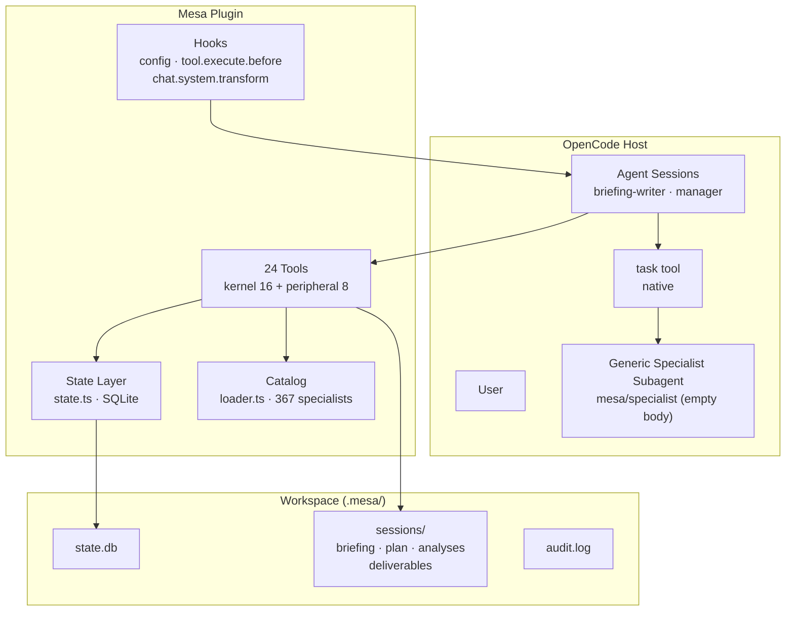

# Architecture Reference

Technical architecture of the Mesa plugin — the kernel/shell model, data preconditions, state, and design decisions.

> **Diátaxis category**: Reference

## Kernel / Shell Model

Mesa is an **adaptive orchestrator**. The codebase is split by one test: *is this a seam, or a recipe?*

- **Kernel (code)**: only what is a **seam** between sessions, state, and audit — things a prompt cannot enforce.
- **Shell (prompts)**: workflow topology, consensus format, rigor, domain recipes — the Manager's judgment, expressed in `src/agents/manager.md`.

### The K1–K5 Seam Test

A capability stays in code **iff** it matches one of these:

| # | Kernel keeps | Reason |
|---|--------------|--------|
| **K1** | Cross-session capture (hooks, `ask_peer`, persona injection) | Impossible via prompt — the Manager does not control the runtime |
| **K2** | Artifact integrity (canonical writes, path containment, dedup) | State corruption is irreversible |
| **K3** | Human approval gates (briefing, team, deliverables, plan) | Trust boundary — a chokepoint the agent cannot silently forge |
| **K4** | Circuit breakers (session budgets, rate caps) | Protect against the LLM itself |
| **K5** | Tamper-evident audit log | A falsifiable trail defeats the point |

**Lives in the shell (prompt)**: pipeline/topology of the workflow, consensus format, rigor levels, journey/phase recipes, implementation/verification rituals, journey/phase detection. The old phase×mode state machine (`VALID_TRANSITIONS`, `VALID_MODE_TRANSITIONS`, `requirePhase`/`requireMode`, `define_phases`) died integrally.

### Data Preconditions (Replacing the State Machine)

Guards are **data-checkable preconditions**, never pipeline positions. A precondition is legitimate iff it (a) is checkable without interpreting content, (b) protects a trust boundary or integrity, and (c) has an audited human override. Global guard: all mutations require session `status == "active"`.

| Tool | Code-enforced precondition |
|------|---------------------------|
| `create_briefing` / `import_briefing` | No briefing with status ≠ `rejected` in the session |
| `approve_briefing` | Briefing `draft` → `approved`; the **only** path to approved |
| `propose_team` | Briefing `approved` |
| `summon_team` | A pending proposal exists |
| `open_round` | Briefing approved ∧ ≥1 summoned member ∧ **plan approved (pointer)** ∧ no open round ∧ `rounds.length < 12` ∧ participants ⊆ team (**hard error**) |
| `register_analysis` | Round open ∧ agent ∈ participants ∧ dedup `UNIQUE(session, round, agent, turn, turn_type)` ∧ ≤40 analyses/round ∧ `delta` requires a prior `full` |
| `get_peer_analyses` | None (read-only) |
| `close_round` | Round open ∧ completeness (≥1 self-registered analysis per participant with a lexical POSITION block; `registered_by_manager` entries don't count) ∧ `evidencePaths[]` non-empty; completeness override requires `humanOverride: true` (audited) |
| `record_decision` | Global guard only |
| `produce_deliverable` | ≥1 closed round with ≥1 analysis OR `humanOverride: true` (audited) ∧ path contained in session folder |
| `approve_deliverable` | Deliverable `draft` → `approved`/`rejected`; the **only** path |
| `ask_peer` | Busy-check + session lookup + tool lockdown + rate cap (2/turn) + peer auto-registered |
| `pause` / `resume` / `cancel` | Trivial status transitions |

**Design rule**: code enforces; error messages teach recovery (self-documenting guards); the prompt teaches philosophy in exactly one paragraph. Precondition tables in the prompt would re-create pipeline-thinking.

## Component Overview


```mermaid
graph TB
    subgraph "OpenCode Host"
        User[User]
        Agents[Agent Sessions\nbriefing-writer · manager]
        TaskTool[task tool\nnative]
        SubAgents["Generic Specialist Subagent\nmesa/specialist (empty body)"]
    end

    subgraph "Mesa Plugin"
        Tools["24 Tools\nkernel 16 + peripheral 8"]
        State["State Layer\nstate.ts · SQLite"]
        Catalog["Catalog\nloader.ts · 367 specialists"]
        Hooks["Hooks\nconfig · tool.execute.before\nchat.system.transform"]
    end

    subgraph "Workspace (.mesa/)"
        Db[state.db]
        Sessions["sessions/\nbriefing · plan · analyses\ndeliverables"]
        AuditFile[audit.log]
    end

    Tools --> State --> Db
    Tools --> Sessions
    Tools --> Catalog
    Hooks --> Agents
    Agents --> Tools
    Agents --> TaskTool --> SubAgents
```

## Module Descriptions

### Tools (`src/tools/`)

Eleven modules registering 24 tools via the `tool()` helper:

| Module | Tools | Purpose |
|--------|-------|---------|
| `mesa-tools.ts` | `mesa_status` | Plugin health, session summary, plan-gate instruction |
| `catalog-tools.ts` | `list_specialists`, `get_specialist` | Browse and retrieve specialist profiles |
| `briefing-tools.ts` | `create_briefing`, `approve_briefing`, `import_briefing` | Briefing lifecycle (approval absorbs delivery) |
| `manager-tools.ts` | `propose_team`, `summon_team` | Team assembly gates |
| `round-tools.ts` | `open_round`, `close_round` | The universal discussion primitive |
| `discussion-tools.ts` | `register_analysis`, `get_peer_analyses`, `pause_discussion`, `resume_discussion`, `cancel_discussion` | Analysis capture and session lifecycle |
| `decision-tools.ts` | `record_decision`, `produce_deliverable`, `approve_deliverable` | Audited decisions and canonical artifacts |
| `peer-tools.ts` | `ask_peer` | Cross-session peer consultation (K1/K4) |
| `memory-tools.ts` | `memory_store`, `memory_recall`, `memory_forget` | Cross-session knowledge persistence |
| `update-tools.ts` | `mesa_check_update`, `mesa_update` | Self-update |

**Kernel 16**: `mesa_status`, `list_specialists`, `get_specialist`, `create_briefing`, `import_briefing`, `approve_briefing`, `propose_team`, `summon_team`, `open_round`, `register_analysis`, `get_peer_analyses`, `close_round`, `record_decision`, `produce_deliverable`, `approve_deliverable`, `ask_peer`.

**Peripheral 8**: `pause_discussion`, `resume_discussion`, `cancel_discussion`, `memory_store`, `memory_recall`, `memory_forget`, `mesa_check_update`, `mesa_update`.

### State (`src/state.ts`, `src/audit.ts`) — v15

State lives in **SQLite** at `.mesa/state.db` (Bun SQLite), with session-scoped tables. Legacy `.mesa/state.json` files are migrated automatically on first load.

State follows a strict load → mutate → save pattern with atomic writes, and every significant action is appended to `.mesa/audit.log` with a timestamp and the current `planVersion` — plan decisions and amendments cannot be causally re-shuffled retroactively (K5 sharpening).

**`CURRENT_STATE_VERSION = 15`**. The v14 structural migration (still the live schema) introduced:

- **`rounds[]`** (append-only, JSON column) — the universal deliberation primitive. `AnalysisEntry` carries a `roundId` FK. Legacy analyses are backfilled into a synthetic closed round `legacy-round-1`.
- **`deliverables[]`** (JSON column) — generalizes specification/appendices/journeys: `{path, kind, status, provenance: {roundIds}}`. Legacy specs backfill as `kind: "specification"`.
- **`plan`** (JSON column) — the plan pointer: `{path, version, status, approvedAt}`.
- **`mesa_votes` dropped** — exported to the audit log before removal (structured voting is dead; positions are declared).

Key types (`src/types.ts`):

```ts
interface Round {
  id: string                    // "r1", "r2", ... ("legacy-round-1" for backfill)
  topic: string
  participants: string[]        // ⊆ team (hard error otherwise)
  status: "open" | "closed"
  openedAt: string
  closedAt?: string
  outcome?: RoundOutcome
}

interface RoundOutcome {
  decision: "converged" | "converged-with-open-tensions" | "escalated"
  summary: string
  tensions: string[]            // verbatim from declared positions
  evidencePaths: string[]       // non-empty — anti-rubber-stamping
  positions: Record<string, string>  // agentId → declared position
}

interface Deliverable {
  path: string
  kind: "specification" | "overview" | "journeys" | "appendix" | "other"
  status: "draft" | "approved" | "rejected"
  provenance: { roundIds: string[] }
}

interface PlanPointer {
  path: string
  version: number
  status: "draft" | "approved"
  approvedAt?: string
}
```

One round may be open at a time (cheap sanity invariant for the audit).

### Circuit Breakers (`src/config.ts`)

Constants protecting against the LLM itself (K4). Overrides require a human-authorized, audited `record_decision`.

| Constant | Value | Guards |
|----------|-------|--------|
| `MAX_ROUNDS_PER_SESSION` | 12 | `open_round` — non-converging composition |
| `MAX_ANALYSES_PER_ROUND` | 40 | `register_analysis` — runaway rounds |
| `PEER_CONSULTATION_CAP` | 2 | `ask_peer` — per-turn peer consultations |

### Catalog (`src/catalog/`)

367 specialist personas loaded from bundled `.md` files (YAML frontmatter + body), parsed once and cached in memory. Each specialist has `id`, `name`, `description`, `division`, and `systemPrompt`.

### Workflow (`src/workflow/`)

- **`specialist-injection.ts`** — the `tool.execute.before` hook intercepts `task` calls for `mesa/specialist` and resolves the persona in order: (1) session resumption (`task_id="ses_..."` — pass through), (2) **inline `<specialist-persona id="...">` block in the prompt (primary path — for runtimes rejecting non-`ses_` task IDs)**, (3) `task_id` slug `mesa-{personaId}` (hook injects the persona from the catalog). If no persona resolves, a `<specialist-setup-error>` notice is prepended instead of blocking the call.
- **`tool-visibility.ts`** — per-agent tool visibility filtering (see below).
- **`transitions.ts`** — legacy status transitions (active/paused/cancelled) only.

### Tool Visibility Filtering (Spec D8)

The `config` hook (`applySpecialistToolPermissions`) injects `deny` permission rules for every registered Mesa tool **not** in the specialist allowlist into `agent["mesa/specialist"].permission`:

```ts
SPECIALIST_ALLOWED_TOOLS = [
  "register_analysis", "get_peer_analyses", "ask_peer",
  "memory_store", "memory_recall", "memory_forget", "mesa_status",
]
```

OpenCode removes permission-denied tools from the LLM request payload at request-build time (`resolveTools`), so this is a **real token saving** (~5.3k per specialist session), not just execution blocking. Properties:

- **Self-healing**: derived from the live tool registry — the deny list can never drift from registered tools.
- **Named agents left untouched**: `manager` and `briefing-writer` keep the full kernel.
- **Never clobbers**: explicit pre-existing rules (e.g. user overrides in `opencode.json`) are preserved.

### Plan Gate (`src/utils/plan-gate.ts`)

Single source of truth for "no approved plan" recovery, surfaced ambiently by `mesa_status` and as a hard precondition by `open_round`. Distinguishes:

- **Legacy session** (v14/v15-migrated — `rounds[]` contains a `legacy-*` round): the workflow was approved under the old pipeline; silently adopting a synthesized plan would violate the gate retroactively. The Manager must synthesize a `workflow-plan.md` mapping existing artifacts to remaining steps and present it to the human.
- **Fresh session**: the Manager writes the plan before the first round (gate 0).

Approval is recorded via `record_decision(type="gate", target="plan", payload={path})` — the only path to an approved plan pointer. `type="plan-amendment"` bumps the version (must strictly increase); `type="override"` force-approves with an explicit audit marking.

### Errors (`src/errors.ts`)

| Class | Use |
|-------|-----|
| `MesaError` | Base class for all Mesa errors |
| `PhaseError` | Invalid lifecycle/status operation |
| `StateError` | State corruption, missing state |
| `ValidationError` | Invalid tool parameters |
| `CatalogError` | Specialist not found, catalog load failure |

### Session Folder Layout

All session artifacts live under `.mesa/sessions/{YYYYMMDDHHmm}_{4hex}_{slug}/`:

```
.mesa/
├── state.db                          # SQLite state (v15)
├── audit.log                         # Tamper-evident action trail
└── sessions/
    └── 202608012203_040c_my-project/
        ├── briefing.md               # Approved briefing
        ├── workflow-plan.md          # The plan (intention layer)
        ├── analyses/
        │   ├── turn1/{personaId}.md
        │   ├── discussion-r{R}/{personaId}.md
        │   └── ask_peer/{caller}_{callee}_{id}.md
        ├── specification.md          # kind="specification"
        ├── overview.md               # kind="overview"
        ├── appendices/               # kind="appendix"
        └── deliverables/             # kind="other"
```

Canonical artifact writes use temp-file + atomic rename; paths are validated for workspace containment (K2). Approved deliverables are immutable — re-production at the same path is refused.

## How Tools Are Registered

The plugin entry (`src/index.ts`) returns the plugin definition:

```typescript
export const mesa: Plugin = async (input) => {
  const mesaTools = { mesa_status: ..., /* 24 tools */ }
  return {
    tool: mesaTools,
    config: async (config) => {
      applySpecialistToolPermissions(config, Object.keys(mesaTools))
    },
    "tool.execute.before": async (toolInput, output) => { /* persona injection */ },
    "experimental.chat.system.transform": async (_input, output) => { /* Mesa context + memory hint */ },
  }
}
```

## Design Decisions (Recap)

- **Specialists are real subagents** — each runs in its own session with its own system prompt, injected at delegation time.
- **State is file-based** — SQLite plus Markdown artifacts in `.mesa/`. No external services.
- **The Manager never generates domain content** — it orchestrates. It judges process convergence (WHETHER), never content merit (WHO).
- **Consensus is emergent** — specialists declare POSITION blocks; a declared `disagree` vetoes `converged`; decisions must cite evidence paths.
- **The plan is the contract** — intention (file), fact (state pointer), trace (`rounds[]`). Silent replanning is detectable via version bumps and audit entries.
- **Human approval gates** — briefing, team, plan, and deliverables each have a tool-mediated gate (K3). Verbal approval is never sufficient.
