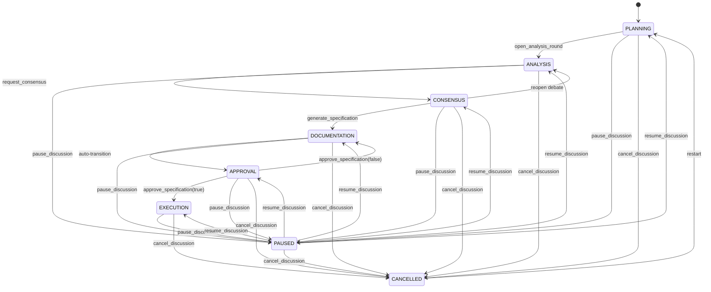

# Workflow Reference

Detailed reference for the Mesa workflow, covering all phases, transitions, and common usage patterns.

## Phase Reference

### PLANNING

**Purpose**: The Manager agent analyzes the briefing, browses the specialist catalog, proposes a team, and configures the workflow phases.

**Available tools**: `analyze_briefing`, `list_specialists`, `get_specialist`, `propose_team`, `summon_team`, `define_phases`, `open_analysis_round`, `import_briefing`, `pause_discussion`, `cancel_discussion`

**Entry conditions**: Initial state, or entered from `CANCELLED` (restart), `PAUSED` (resume), or `deliver_briefing` (from briefing phase).

**Exit conditions**: Transitions to `ANALYSIS` via `open_analysis_round`, or to `PAUSED`/`CANCELLED` via the respective tools.

---

### ANALYSIS

**Purpose**: Each specialist analyzes the briefing from their unique perspective across multiple turns. The Manager orchestrates specialist invocation via OpenCode's native `task` tool.

**Available tools**: `register_analysis`, `request_consensus`, `pause_discussion`, `cancel_discussion`

**Entry conditions**: Entered from `PLANNING` via `open_analysis_round`, from `CONSENSUS` (reopened debate), or from `PAUSED` (resume).

**Exit conditions**: Transitions to `CONSENSUS` via `request_consensus`, or to `PAUSED`/`CANCELLED`.

---

### CONSENSUS

**Purpose**: Specialists vote on the combined analysis. If disagreements exist, the Manager can reopen a debate round.

**Available tools**: `request_consensus` (debate re-vote), `generate_specification`, `open_analysis_round` (reopen debate), `pause_discussion`, `cancel_discussion`

**Entry conditions**: Entered from `ANALYSIS` via `request_consensus`, or from `PAUSED` (resume).

**Exit conditions**: Transitions to `DOCUMENTATION` via `generate_specification`, back to `ANALYSIS` (reopened debate), or to `PAUSED`/`CANCELLED`.

---

### DOCUMENTATION

**Purpose**: The specification document is compiled from all specialist sections. This phase auto-transitions to `APPROVAL`.

**Available tools**: (auto-transition — no user-facing tools), `pause_discussion`, `cancel_discussion`

**Entry conditions**: Entered from `CONSENSUS` via `generate_specification`. Auto-transitions to `APPROVAL`.

**Exit conditions**: Auto-transitions to `APPROVAL`, or to `PAUSED`/`CANCELLED`.

---

### APPROVAL

**Purpose**: The human reviews the generated specification and approves or rejects it.

**Available tools**: `approve_specification`, `pause_discussion`, `cancel_discussion`

**Entry conditions**: Entered from `DOCUMENTATION` (auto-transition), from `DOCUMENTATION` (specification rejected), or from `PAUSED` (resume).

**Exit conditions**: Transitions to `EXECUTION` via `approve_specification(approved=true)`, back to `DOCUMENTATION` via `approve_specification(approved=false)`, or to `PAUSED`/`CANCELLED`.

---

### EXECUTION

**Purpose**: The Manager delegates implementation tasks to individual specialists.

**Available tools**: `delegate_task`, `pause_discussion`, `cancel_discussion`

**Entry conditions**: Entered from `APPROVAL` via `approve_specification(approved=true)`, or from `PAUSED` (resume).

**Exit conditions**: Transitions to `PAUSED` or `CANCELLED`. No terminal "done" state — the workflow simply ends when all tasks are delegated.

---

### PAUSED

**Purpose**: Temporarily suspends the discussion. State is fully preserved for later resumption.

**Entry conditions**: Can be entered from any active phase via `pause_discussion`.

**Exit conditions**: Transitions to any active phase via `resume_discussion(target_phase=...)`, or to `CANCELLED`.

---

### CANCELLED

**Purpose**: Terminates the current discussion. Clears analysis data but preserves the briefing and team.

**Entry conditions**: Can be entered from any phase via `cancel_discussion`.

**Exit conditions**: Transitions to `PLANNING` (restart). The briefing and team from the previous run are preserved.

---

## State Machine Diagram



## Common Workflows

### Single-Round Analysis

The simplest workflow — one round of analysis, consensus, and specification:

```
1. /agent briefing-writer              → Briefing Writer conducts discovery
2. approve_briefing()                  → User approves the briefing
3. deliver_briefing()                  → Transitions to PLANNING
4. /agent manager                      → Switch to Manager
5. propose_team(specialists=[...])     → Manager proposes team
6. summon_team()                       → User approves, team summoned
7. open_analysis_round(topic="...", participants=[...])
8. register_analysis(...) × N          → Each specialist analyzes
9. request_consensus(votes=[...])      → Specialists vote
10. generate_specification(sections=[...])
11. approve_specification(approved=true)
12. delegate_task(...) × N             → Execute implementation tasks
```

### Multi-Turn Debate

When specialists disagree and need additional rounds:

```
1-8. (same as single-round)
9. request_consensus(votes=[
     { agent_id: "A", vote: 1, reason: "Agree" },
     { agent_id: "B", vote: 0, reason: "Disagree: missing security analysis" }
   ], round=1)
   → Consensus fails (DISAGREE vote)
10. Manager reopens analysis for specialist B with debate context
11. register_analysis(agent_id="B", ..., turn=2)  → Second turn with new input
12. request_consensus(votes=[...], round=2)        → Re-vote
13. (if consensus reached) → generate_specification → approve → execute
```

### Specification Revision Loop

When the human rejects the specification:

```
1-10. (same as single-round through generate_specification)
11. approve_specification(approved=false, feedback="Missing error handling section")
    → Returns to DOCUMENTATION phase
12. Manager requests additional analysis on the feedback topic
13. open_analysis_round(force=true, ...)  → Opens new round (force required)
14. register_analysis(...) × N
15. request_consensus(...) → generate_specification(...)
16. approve_specification(approved=true)   → This time approved
17. delegate_task(...) × N
```
