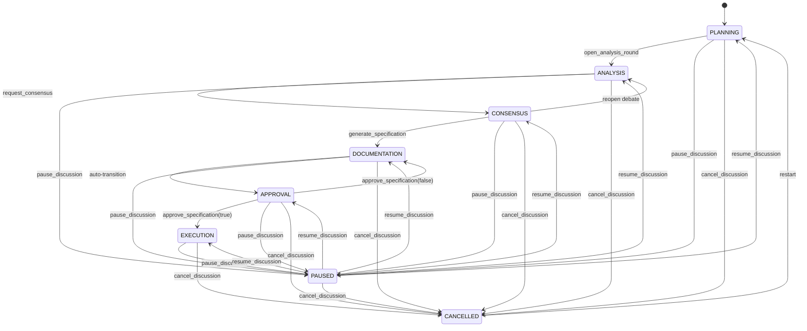

# Workflow Reference

Detailed reference for the Mesa workflow, covering all phases, transitions, and common usage patterns.

## Phase Reference

### PLANNING

**Purpose**: The Manager agent analyzes the briefing, browses the specialist catalog, proposes a team, and configures the workflow phases.

**Available tools**: `analyze_briefing`, `list_specialists`, `get_specialist`, `propose_team`, `summon_team`, `define_phases`, `open_analysis_round`, `import_briefing`, `pause_discussion`, `cancel_discussion`

**Entry conditions**: Initial state, or entered from `CANCELLED` (restart), `PAUSED` (resume), or `deliver_briefing` (from briefing phase).

**Exit conditions**: Transitions to `ANALYSIS` via `open_analysis_round`, or to `PAUSED`/`CANCELLED` via the respective tools.

---

### ANALYSIS

**Purpose**: Each specialist analyzes the briefing from their unique perspective across multiple turns. The Manager orchestrates specialist invocation via OpenCode's native `task` tool.

**Available tools**: `register_analysis`, `request_consensus`, `pause_discussion`, `cancel_discussion`

**Entry conditions**: Entered from `PLANNING` via `open_analysis_round`, from `CONSENSUS` (reopened debate), or from `PAUSED` (resume).

**Exit conditions**: Transitions to `CONSENSUS` via `request_consensus`, or to `PAUSED`/`CANCELLED`.

---

### CONSENSUS

**Purpose**: Specialists vote on the combined analysis. If disagreements exist, the Manager can reopen a debate round.

**Available tools**: `request_consensus` (debate re-vote), `generate_specification`, `open_analysis_round` (reopen debate), `pause_discussion`, `cancel_discussion`

**Entry conditions**: Entered from `ANALYSIS` via `request_consensus`, or from `PAUSED` (resume).

**Exit conditions**: Transitions to `DOCUMENTATION` via `generate_specification`, back to `ANALYSIS` (reopened debate), or to `PAUSED`/`CANCELLED`.

---

### DOCUMENTATION

**Purpose**: The specification document is compiled from all specialist sections. This phase auto-transitions to `APPROVAL`.

**Available tools**: (auto-transition — no user-facing tools), `pause_discussion`, `cancel_discussion`

**Entry conditions**: Entered from `CONSENSUS` via `generate_specification`. Auto-transitions to `APPROVAL`.

**Exit conditions**: Auto-transitions to `APPROVAL`, or to `PAUSED`/`CANCELLED`.

---

### APPROVAL

**Purpose**: The human reviews the generated specification and approves or rejects it.

**Available tools**: `approve_specification`, `pause_discussion`, `cancel_discussion`

**Entry conditions**: Entered from `DOCUMENTATION` (auto-transition), from `DOCUMENTATION` (specification rejected), or from `PAUSED` (resume).

**Exit conditions**: Transitions to `EXECUTION` via `approve_specification(approved=true)`, back to `DOCUMENTATION` via `approve_specification(approved=false)`, or to `PAUSED`/`CANCELLED`.

---

### EXECUTION

**Purpose**: The Manager delegates implementation tasks to individual specialists. EXECUTION starts with a mandatory **Phase Gate** check — the Manager calls `check_execution_phases` to detect whether the approved specification contains an execution plan with structured phases.

**Available tools**: `delegate_task`, `check_execution_phases`, `select_phases_for_analysis`, `configure_phase_observation`, `open_phase_analysis_round`, `request_phase_consensus`, `generate_phase_appendix`, `detect_phases`, `pause_discussion`, `cancel_discussion`

> **Phase Gate**: If phases are detected, the human chooses between proceeding directly to implementation or running per-phase deep-dive analysis. See [Iterative Phase Analysis Workflow](#iterative-phase-analysis-workflow) for the full sub-workflow.

**Entry conditions**: Entered from `APPROVAL` via `approve_specification(approved=true)`, or from `PAUSED` (resume).

**Exit conditions**: Transitions to `PAUSED` or `CANCELLED`. No terminal "done" state — the workflow simply ends when all tasks are delegated.

---

### PAUSED

**Purpose**: Temporarily suspends the discussion. State is fully preserved for later resumption.

**Entry conditions**: Can be entered from any active phase via `pause_discussion`.

**Exit conditions**: Transitions to any active phase via `resume_discussion(target_phase=...)`, or to `CANCELLED`.

---

### CANCELLED

**Purpose**: Terminates the current discussion. Clears analysis data but preserves the briefing and team.

**Entry conditions**: Can be entered from any phase via `cancel_discussion`.

**Exit conditions**: Transitions to `PLANNING` (restart). The briefing and team from the previous run are preserved.

---

## State Machine Diagram



## Common Workflows

### Single-Round Analysis

The simplest workflow — one round of analysis, consensus, and specification:

```
1. /agent briefing-writer              → Briefing Writer conducts discovery
2. approve_briefing()                  → User approves the briefing
3. deliver_briefing()                  → Transitions to PLANNING
4. /agent manager                      → Switch to Manager
5. propose_team(specialists=[...])     → Manager proposes team
6. summon_team()                       → User approves, team summoned
7. open_analysis_round(topic="...", participants=[...])
8. register_analysis(...) × N          → Each specialist analyzes
9. request_consensus(votes=[...])      → Specialists vote
10. generate_specification(sections=[...])
11. approve_specification(approved=true)
12. delegate_task(...) × N             → Execute implementation tasks
```

### Multi-Turn Debate

When specialists disagree and need additional rounds:

```
1-8. (same as single-round)
9. request_consensus(votes=[
     { agent_id: "A", vote: 1, reason: "Agree" },
     { agent_id: "B", vote: 0, reason: "Disagree: missing security analysis" }
   ], round=1)
   → Consensus fails (DISAGREE vote)
10. Manager reopens analysis for specialist B with debate context
11. register_analysis(agent_id="B", ..., turn=2)  → Second turn with new input
12. request_consensus(votes=[...], round=2)        → Re-vote
13. (if consensus reached) → generate_specification → approve → execute
```

### Specification Revision Loop

When the human rejects the specification:

```
1-10. (same as single-round through generate_specification)
11. approve_specification(approved=false, feedback="Missing error handling section")
    → Returns to DOCUMENTATION phase
12. Manager requests additional analysis on the feedback topic
13. open_analysis_round(force=true, ...)  → Opens new round (force required)
14. register_analysis(...) × N
15. request_consensus(...) → generate_specification(...)
16. approve_specification(approved=true)   → This time approved
17. delegate_task(...) × N
```

---

## Iterative Phase Analysis Workflow

After a master specification is approved, Mesa can optionally open structured analysis rounds for individual execution phases. This produces **phase appendices** that become the authoritative specification for those phases.

### When to Use

Choose iterative phase analysis when:

- The master specification contains an execution plan with multiple phases.
- One or more phases involve uncertain technical decisions.
- Complex integration points or significant architectural changes exist.
- The project is large enough that analyzing all details upfront produces an unwieldy specification.

The workflow is **skipped** when:

- The specification is analysis-only (no execution plan).
- The human chooses to proceed directly to implementation.
- No phases are detected in the master specification.

### Full Flow Diagram

```mermaid
flowchart TD
    A[Master Spec Approved] --> B{detect_phases}
    B -->|No phases / analysis-only| C[Proceed to implementation]
    B -->|Phases detected| D{Human choice}

    D -->|[1] Implement directly| C
    D -->|[2] Deep-dive phases| E[select_phases_for_analysis]

    E --> F{Which phases?}
    F -->|none| C
    F -->|1, 3, 5 / all| G{Observation mode}

    G -->|[1] Guided| H[configure_phase_observation<br/>mode=guided]
    G -->|[2] Automatic| I[configure_phase_observation<br/>mode=automatic]

    H --> J[Human answers 2-4 questions]
    J --> K[open_phase_analysis_round]
    I --> K

    K --> L[Specialists analyze<br/>register_analysis]
    L --> M[request_phase_consensus]

    M -->|Consensus reached| N[generate_phase_appendix]
    M -->|Disagreement| O[Debate round]
    O --> L

    N --> P{More phases?}
    P -->|Yes| K
    P -->|No| Q[All appendices approved]

    Q --> R[delegate_task<br/>uses appendix as authority]
```

### Human Decision Points

The workflow presents three human decision points:

1. **Implement vs. Deep-dive** (after `check_execution_phases`)
   ```
   [1] Proceed to implementation — delegate all phases based on the master spec.
   [2] Deep-dive selected phases — open structured analysis rounds for phases
       that need further exploration.
   ```

2. **Phase Selection** (after choosing [2])
   ```
   Select phases: "1, 3, 5"  (comma-separated, ranges like "1-3", or "all")
   ```

3. **Observation Mode** (per phase)
   ```
   [1] Guided — 2-4 targeted questions per phase before analysis begins
   [2] Automatic — run phase analysis immediately with no additional human input
   ```

### Mini-Briefing Mode vs. Automatic Mode

| Aspect | Guided (Mini-Briefing) | Automatic |
|--------|------------------------|-----------|
| Human input | Required — answers 2-4 questions | None |
| Questions | Tailored to phase type (infra, API, UI, etc.) | N/A |
| Context | Observations persisted to phase sidecar | Phase context contains empty observations |
| Use case | Complex phases with domain-specific constraints | Straightforward phases with clear scope |
| Time | Longer (human-in-the-loop) | Faster (fully automated) |

The `configure_phase_observation` tool generates questions using keyword heuristics:

- **Infra phases**: cloud constraints, monitoring, secrets, IAM
- **Data phases**: integrity risks, schema versioning, concurrent writes
- **API phases**: backward compatibility, rate limiting, observability
- **UI phases**: accessibility, browser support, state management
- **Test phases**: coverage thresholds, critical journeys, mocking
- **Security phases**: compliance standards, secrets management, input validation
- **Integration phases**: touched systems, rollback strategy, contract tests
- **Default**: scope boundaries, external dependencies, hard constraints, acceptance criteria

### State Transitions

Phase analysis is a **sub-workflow within EXECUTION**, not a new top-level phase. The master state machine remains unchanged.

```
APPROVAL ──approve_specification(true)──► EXECUTION
                                              │
                                              ▼
                                    ┌───────────────────┐
                                    │  Phase Analysis   │
                                    │    Sub-Workflow   │
                                    │  (within EXECUTION)│
                                    └───────────────────┘
                                              │
                                              ▼
                                    delegate_task (uses appendix)
```

Within the sub-workflow, each phase progresses through its own micro-state machine, tracked in the `mesa_phase_context` sidecar:

| Sidecar Status | Meaning |
|----------------|---------|
| `analysis_opened` | Round opened, awaiting specialist analyses |
| `consensus_reached` | Votes recorded, consensus achieved |
| `debate_needed` | Votes recorded, disagreement persists |
| `approved` | Appendix generated and canonicalized |

### Common Phase Analysis Workflow

**Automatic mode, all phases:**

```
1. approve_specification(approved=true)     → Enter EXECUTION
2. check_execution_phases()                 → Detect phases, human chooses [2]
3. select_phases_for_analysis(selection="all", phase_count=5)
4. configure_phase_observation(mode="automatic", phase_name="Foundation")
5. open_phase_analysis_round(phase_index=1, phase_name="Foundation", mode="auto")
6. register_analysis(...) × N               → Specialists analyze
7. request_phase_consensus(votes=[...], consensus_reached=true)
8. generate_phase_appendix(phase_index=1, phase_name="Foundation", ...)
9. (repeat 4-8 for remaining phases)
10. delegate_task(personaId="...", task="...", phase_name="Foundation")
    → Automatically resolves appendix as authority
```

**Guided mode, selected phases:**

```
1-3. (same as automatic)
4. configure_phase_observation(mode="guided", phase_name="Core Tools",
       master_spec_context="Build 4 public tools for phase analysis...")
   → Returns 4 targeted questions
5. Human answers questions (outside tool flow)
6. open_phase_analysis_round(phase_index=2, phase_name="Core Tools",
       mode="observed", observations="<human answers>")
7-10. (same as automatic)
```

### Phase Analysis Tools Reference

| Tool | Purpose | Called By |
|------|---------|-----------|
| `detect_phases` | Extract phases from master spec | Manager (implicit via `check_execution_phases`) |
| `open_phase_analysis_round` | Open analysis for one phase | Manager |
| `request_phase_consensus` | Record consensus votes | Manager |
| `generate_phase_appendix` | Produce canonical appendix | Manager |
| `check_execution_phases` | Present human with implement/deep-dive choice | Manager |
| `select_phases_for_analysis` | Parse and store phase selection | Manager |
| `configure_phase_observation` | Configure guided/auto mode, generate questions | Manager |

See [Appendices Reference](appendices.md) for appendix document structure and [Architecture Reference](architecture.md) for sidecar and file layout details.
