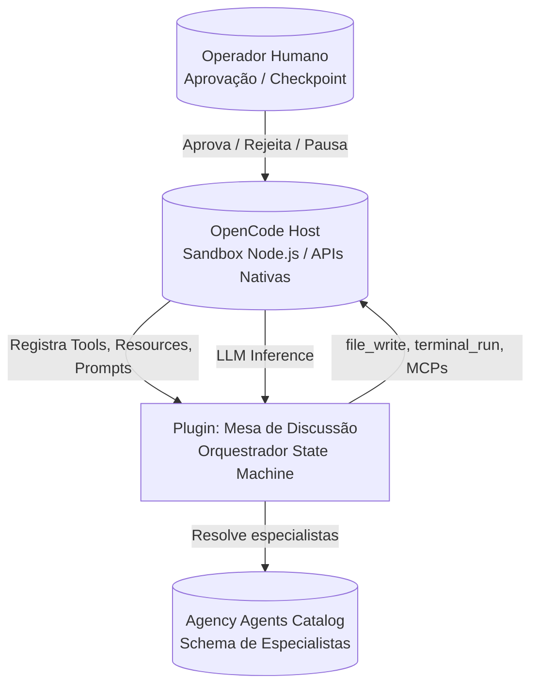
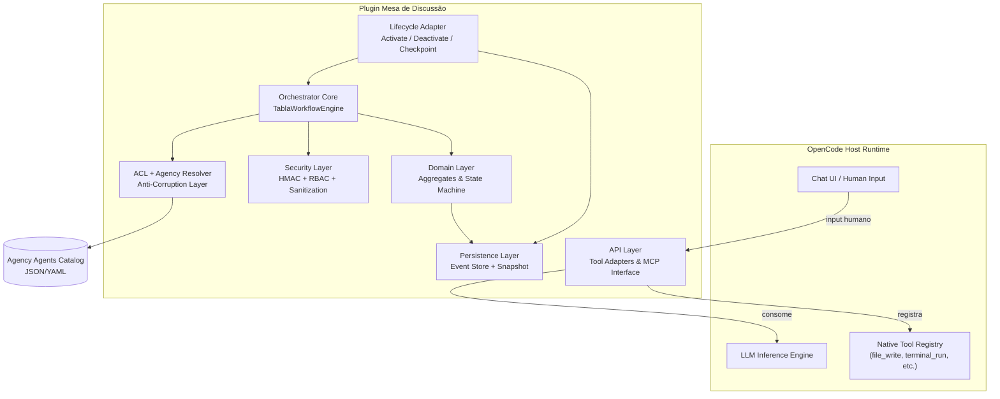

# 01. Visão Arquitetural e Princípios de Design

## 1.1. Natureza da Migração

Este projeto não é um *port* de código, mas uma **reconstrução arquitetural com reaproveitamento de regras de negócio**. O protótipo `tabla-go` opera como uma aplicação desktop autônoma (Wails + Go) com controle total sobre runtime, filesystem, banco SQLite e goroutines. O plugin alvo opera dentro de um **sandbox Node.js/TypeScript** hospedado pelo OpenCode, onde o plugin é *guest* e o host detém o monopólio sobre ferramentas de I/O, inferência LLM e ciclo de vida de processo.

> **Decisão Arquitetural ADR-SA-001**: O plugin será tratado como uma **extensão stateful de orquestração**, não como uma aplicação standalone. Toda capacidade nativa de filesystem, terminal e MCP que existir no protótipo Go será descartada e substituída por chamadas às APIs nativas do OpenCode através de uma camada de Adapter isolada.

## 1.2. Princípios Não Negociáveis

| Princípio | Justificativa | Implicação |
|-----------|---------------|------------|
| **Domain First** | O modelo de orquestração (discussão → consenso → documentação → aprovação → execução) é o core diferencial | O design de infraestrutura serve ao domínio, nunca o contrário |
| **Host Tools Only** | Um plugin sandboxed que reimplementa ferramentas do host viola contrato de segurança e cria shadow platform | Zero tool calls de I/O implementadas no plugin |
| **Reversibilidade** | Decisões devem ser fáceis de desfazer sem reescrita massiva | Event sourcing, schema versionado e ACL isolam mudanças externas |
| **State as Audit Trail** | Em orquestração multi-agente, não basta saber o estado atual; é preciso saber *como se chegou lá* | Event sourcing local com HMAC por evento |
| **Fail Secure** | Em caso de crash, loop ou injeção, o sistema deve falhar para um estado seguro, nunca para execução automática | Consenso recomenda; humano aprova; nenhuma tool call destrutiva é executada automaticamente |

## 2. Análise do Protótipo tabla-go: Preservar, Reescrever ou Descartar

### 2.1. Ativos a Preservar (Regras de Negócio Validadas)

```
┌─────────────────────────────────────────────────────────────────┐
│  GOVERNANÇA MULTI-AGENTE (Modelo Mental Preservado)             │
│  ├─ Fases sequenciais: Analysis → Consensus → Documentation    │
│  ├─ Turnos ordenados com histórico linear                       │
│  ├─ Consenso estruturado com justificativa obrigatória          │
│  ├─ Aprovação humana por checkpoint                             │
│  └─ Delegação direta pós-aprovação                              │
└─────────────────────────────────────────────────────────────────┘
```

O valor do protótipo reside exclusivamente no **protocolo de interação** validado. O runtime, o motor de persistência SQLite, o sistema de goroutines e o tooling shadow são passivos técnicos descartáveis.

### 2.2. Anti-Padrões Críticos a Eliminar

| Anti-Padrão no Protótipo | Severidade | Consequência | Ação no Plugin |
|--------------------------|------------|--------------|----------------|
| **Shadow Tooling** (fs, terminal, MCPs nativos em Go) | Crítica | Sandbox escape; manutenção duplicada; divergência de segurança | **Descartar** — usar bridge para ferramentas nativas do OpenCode |
| **State Machine Implícita** | Crítica | Transições inválidas possíveis (ex: pular de Analysis para Execution); sem rastreabilidade | **Reescrever** — máquina de estados finita explícita com transições validadas |
| **Acoplamento Estado-Agente em RAM** | Crítica | Crash = perda total de contexto; impossível retomar discussão | **Reescrever** — Event Sourcing em disco com snapshots |
| **Duplo Motor de Workflow** (`WorkflowEngine` genérico vs `StructuredDiscussionManager`) | Alta | Ambiguidade de estado do projeto; concorrência semântica | **Unificar** — `Discussion` como sub-workflow de um motor único |
| **Goroutines sem Cancelamento** | Alta | "Pausar" não pausa o LLM; race conditions em `runAnalysisPhase` | **Reescrever** — async/await com `AbortController` e pending effect ledger |
| **Parsing de Voto por Substring** | Crítica | `strings.Contains("AGREE")` permite bypass de integridade; não determinístico | **Reescrever** — enum Zod rígido com schema de tool call nativo |
| **TriggerManagerAction com Goroutine** | Alta | Reentrancy; loop infinito de discussões aninhadas; gasto exponencial de tokens | **Substituir** — Event Bus interno com controle de profundidade máxima |
| **Delegação Fire-and-Forget** | Alta | Sem rastreabilidade (`task_id`), sem timeout, sem callback | **Reescrever** — delegação com task lifecycle, timeout e compensação |

## 3. Arquitetura de Referência do Plugin

### 3.1. Diagrama de Contexto (C4 - Nível 1)



### 3.2. Diagrama de Container (C4 - Nível 2)



### 3.3. Camadas e Responsabilidades

| Camada | Arquivos/Tipos | Responsabilidade |
|--------|---------------|------------------|
| **API / Adapter Layer** | `src/adapters/opencode-tools.ts`, `src/adapters/mcp-bridge.ts` | Traduz intenções do domínio para tool calls nativas do OpenCode; isola o contrato externo |
| **Orchestration / Workflow** | `src/workflow/engine.ts`, `src/workflow/state-machine.ts` | Gerencia fases, transições, timeouts, budget de tempo e recovery |
| **Domain** | `src/domain/aggregates.ts`, `src/domain/events.ts` | Entidades puras (`Discussion`, `Turn`, `Vote`, `Delegation`); regras de negócio sem side effects |
| **ACL / Agency** | `src/agency/resolver.ts`, `src/agency/schema.ts` | Consome catálogo externo, valida schema, mapeia para `SpecialistProfile` interno versionado |
| **Persistence** | `src/persistence/event-store.ts`, `src/persistence/snapshot.ts` | Append-only event log em `.tabla/events/`, projeções de estado, HMAC |
| **Security** | `src/security/hmac.ts`, `src/security/rbac.ts`, `src/security/sanitizer.ts` | Integridade de eventos, controle de transições, sanitização de I/O entre agentes |
| **Lifecycle** | `src/lifecycle/adapter.ts` | Hooks de ativação/desativação do plugin, checkpointing, reconciliação |

## 12. Estrutura de Arquivos e Organização de Módulos (Visão Geral)

```
tabla-opencode-plugin/
├── src/
│   ├── adapters/
│   ├── agency/
│   ├── domain/
│   ├── effects/
│   ├── persistence/
│   ├── security/
│   ├── workflow/
│   ├── lifecycle/
│   └── index.ts
├── tests/
│   ├── unit/
│   ├── integration/
│   └── fixtures/
├── docs/
│   └── adrs/
└── package.json
```

> Veja os arquivos específicos de cada camada em:
> - [03-workflow-state-machine.md](./03-workflow-state-machine.md)
> - [04-mcp-interface.md](./04-mcp-interface.md)
> - [05-camada-ia.md](./05-camada-ia.md)
> - [06-seguranca.md](./06-seguranca.md)
> - [07-persistencia-recuperacao.md](./07-persistencia-recuperacao.md)

## 13. Decisões Arquiteturais Registradas (ADRs)

### ADR-SA-001: Plugin como Extensão Statefull, não Aplicação Standalone
**Status**: Aceita
**Contexto**: O protótipo Go é uma aplicação desktop com controle total. O alvo é um plugin sandboxed.
**Decisão**: Descartar toda camada de tooling nativo (fs, terminal, MCPs) e usar Adapter para APIs do OpenCode.
**Consequências**: Perda de autonomia do runtime; ganho de manutenibilidade, segurança e compatibilidade com o ecossistema do host.

### ADR-SA-002: Event Sourcing Local com Projeções CQRS
**Status**: Aceita
**Contexto**: Necessidade de audit trail completo, recuperação após crash e deterministic replay.
**Decisão**: Estado mutável em JSON descartável (snapshot) derivado de log de eventos append-only em `.tabla/events/`.
**Consequências**: Complexidade adicional de projeção e reconciliação; ganho de rastreabilidade total e debuggabilidade.

### ADR-SA-003: Motor de Workflow Único com Sub-Workflows
**Status**: Aceita
**Contexto**: Protótipo possui `WorkflowEngine` e `StructuredDiscussionManager` independentes.
**Decisão**: Unificar sob `TablaWorkflowEngine`; `Discussion` é um sub-workflow que emite eventos para o motor pai.
**Consequências**: Elimina ambiguidade de estado; exige refatoração completa do modelo de orquestração.

### ADR-SA-004: Separação Decision Core / Effect Interpreter
**Status**: Aceita
**Contexto**: Necessidade de testabilidade e deterministic replay.
**Decisão**: Decision Core (state machine, event sourcing) é puro e deterministico. Effect Interpreter (tool calls nativas, LLM inference) é impuro e isolado.
**Consequências**: Testes unitários podem rodar sem mockar o host; replay exige cache de inferência (ver ADR-SA-005).

### ADR-SA-005: Cache de Inferência para Determinismo de Replay
**Status**: Proposta
**Contexto**: LLMs com temperature > 0 não são deterministicos.
**Decisão**: Todo output de LLM é cacheado com chave `hash(prompt + modelo + versão)`. Modo replay/teste consome cache.
**Consequências**: Overhead de armazenamento; possibilidade de benchmarks de regressão automatizados.

### ADR-SA-006: ACL Versionada para Agency Agents
**Status**: Aceita
**Contexto**: Schema externo do catálogo pode mudar sem aviso.
**Decisão**: Schema interno `SpecialistProfile` é versionado via Zod; mudanças no upstream são absorvidas na ACL.
**Consequências**: Resiliência a evolução externa; custo de manutenção da camada de tradução.

## 14. Riscos Arquiteturais e Mitigações

| Risco | Prob. | Impacto | Mitigação |
|-------|-------|---------|-----------|
| APIs do OpenCode insuficientes para orquestração | Média | Alto | Spike técnico de 1-2 dias no início; Adapter Pattern isola mudanças futuras |
| Context window overflow em discussões longas | Alta | Alto | Context Budget Manager; compressão por turno; RAG sobre event log |
| Plugin descarregado durante operação crítica | Alta | Alto | Pending Effect Ledger + Checkpoint Event + reconciliação na reativação |
| Estado no disco corrompido/editado por outro plugin | Média | Alto | HMAC por evento; validação na carga; fallback para estado seguro |
| Loop de reentrancy / discussão infinita | Média | Alto | `maxDepth = 1`; Event Bus com controle de profundidade; budget de tokens |
| Consenso sobre solução incorreta (alucinação em cascata) | Média | Alto | Devil's Advocate obrigatório; detecção de divergência factual; aprovação humana |
| Bypass de aprovação humana por tool call maliciosa | Baixa | Crítico | RBAC em transições; approval requer nonce + hash; UI bloqueante do host |
| Falta de dynamic tool registration no host | Média | Alto | Fallback para validação programática retornando `isError: true` com mensagem clara |

## 15. Dependências e Próximos Passos Críticos

Para finalizar o design e iniciar a implementação, as seguintes informações sobre o host OpenCode devem ser validadas:

1. **API de Registro de Tools**: O plugin registra tools dinamicamente via objeto/JSON, ou precisa de manifesto estático?
2. **Persistência no Workspace**: O plugin tem acesso garantido de escrita/leitura em subdiretórios do workspace?
3. **Lifecycle Hooks**: Existem callbacks explícitos `onActivate` / `onDeactivate`?
4. **Human Input / Aprovação**: Como o plugin pode apresentar uma escolha bloqueante (Aprovar/Rejeitar) ao operador?
5. **Secrets/Keys**: O OpenCode oferece API para plugins armazenarem/lerem secrets scoped?
6. **Múltiplos Agentes/Models**: O plugin pode solicitar inferências com diferentes system prompts/temperatures, ou o host é monolítico?

**Até que estas questões sejam respondidas**, a camada `adapters/opencode-tools.ts` deve ser implementada como **interface com stub/mock**, permitindo que todo o domínio (`workflow`, `domain`, `security`) seja desenvolvido e testado independentemente da integração final.
