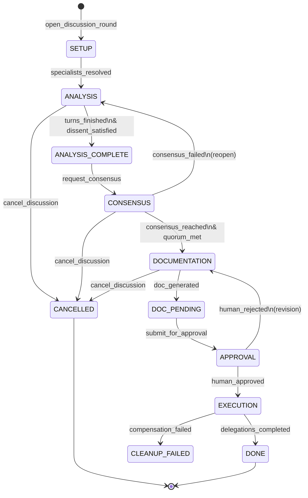
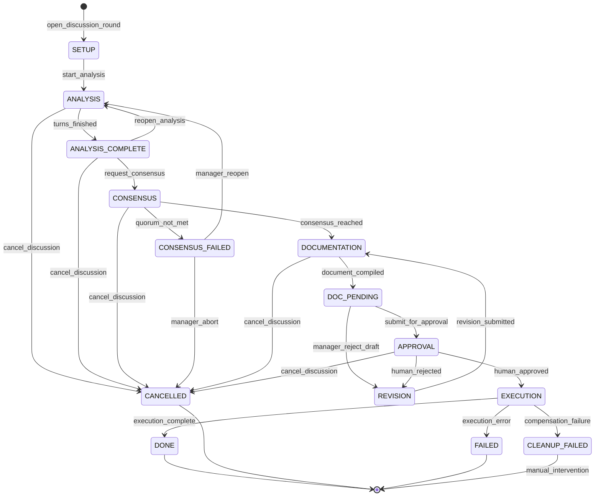
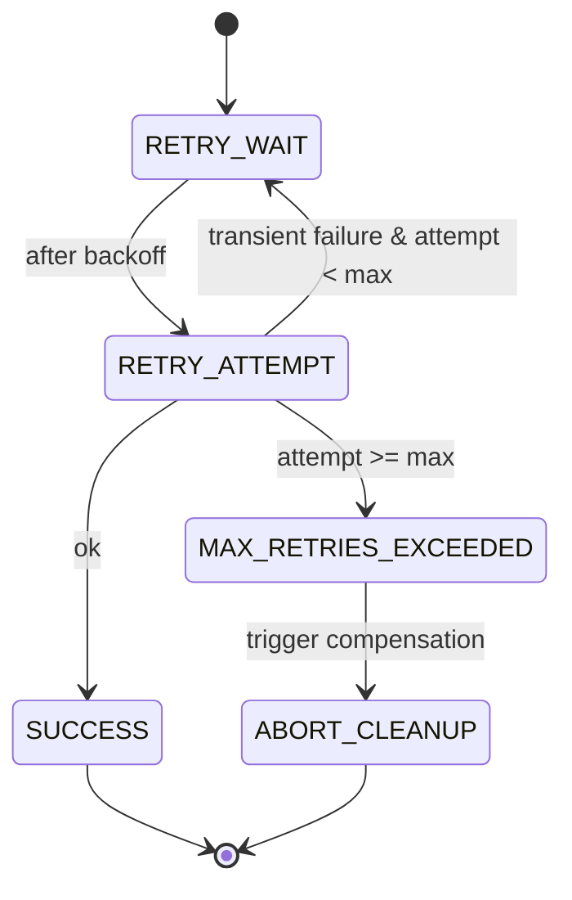

# 03. State Machine e Workflow Engine

## 5.1. Máquina de Estados Hierárquica

A fase `analysis` contém micro-estados de operação, mas o workflow macro é linear com ramificações controladas.



## 2.1 Macro-State Diagram (Workflow Architect)



## 2.2 Transition Rules (Hard Constraints)

The `DiscussionStateMachine` validates every transition against an allow-list. Unauthorized transitions throw `InvalidTransitionError` and emit no events.

```typescript
// src/workflow/state-machine.ts
const VALID_TRANSITIONS: Record<DiscussionPhase, DiscussionPhase[]> = {
  setup: ['analysis', 'cancelled'],
  analysis: ['analysis_complete', 'cancelled'],
  analysis_complete: ['consensus', 'analysis', 'cancelled'],
  consensus: ['documentation', 'consensus_failed', 'cancelled'],
  consensus_failed: ['analysis', 'cancelled'],
  documentation: ['doc_pending', 'cancelled'],
  doc_pending: ['approval', 'revision'],
  approval: ['execution', 'revision', 'cancelled'],
  revision: ['documentation'],
  execution: ['done', 'failed', 'cleanup_failed'],
  // Terminal states
  done: [],
  cancelled: [],
  failed: [],
  cleanup_failed: [],
};
```

## 2.3 Gateway Conditions (Soft Preconditions)

Certain transitions require domain-level preconditions that are checked **after** the hard transition rule passes but **before** the transition is committed. These are configurable per discussion instance.

| Gateway | Prerequisite Event(s) | Config Key |
|---|---|---|
| `ANALYSIS_COMPLETE → CONSENSUS` | All analysis turns finished AND (`dissent_registered` OR `dissent_waived`) | `require_dissent: boolean` |
| `CONSENSUS → DOCUMENTATION` | `ConsensusReached` event exists with `quorum >= config.quorum_min` | `quorum_min: number` (default 0.6) |
| `DOC_PENDING → APPROVAL` | Document hash matches `pending_document.contentHash` (reconciliation) | `reconcile_document: true` |
| `APPROVAL → EXECUTION` | Human approval nonce is valid and not previously consumed | `approval_nonce_required: true` |

**Justification**: Hardcoding `DISSENT_REQUIRED` as a state couples AI semantics to the core state machine. Using a **Gateway Condition** keeps the engine generic while allowing policy injection.

## 2.4 Micro-States (Operation Lifecycle)

Inside `ANALYSIS`, `CONSENSUS`, `DOCUMENTATION`, and `EXECUTION`, operations are async. The micro-state tracks the operation lifecycle independently of the macro-phase.

```typescript
interface OperationContext {
  id: string;                    // op_{uuid}
  status: 'idle' | 'running' | 'pausing' | 'paused' | 'completed' | 'cancelled' | 'timeout';
  abortControllerRef: string;    // key to ephemeral AbortController map (not serialized)
  checkpoint: string;            // e.g., "turn_2_of_3"
  startedAt: number;
  deadlineAt: number;            // computed from budget
}
```

## 5.2. Contratos de Transição (Handoff Contracts)

Cada transição possui pré-condições verificáveis no event log, pós-condições e ação de fallback.

**Exemplo: Handoff `ANALYSIS_COMPLETE → CONSENSUS`**

```typescript
// src/workflow/transitions.ts
const ANALYSIS_TO_CONSENSUS: TransitionContract = {
  from: 'analysis_complete',
  to: 'consensus',
  preconditions: [
    { check: (log) => lastEventOfType(log, 'AnalysisTurnCompleted')?.turn === config.maxTurns },
    { check: (log) => countEvents(log, 'AgentOutputReceived') >= config.participants.length * config.maxTurns },
    { check: (log) => !existsEvent(log, 'DiscussionCancelled') },
    { check: (log) => budgetRemaining(log, 'analysis') > 0 },
    { check: (log) => !config.requireDissent || existsEvent(log, 'DissentRegistered') || existsEvent(log, 'DissentWaived') },
  ],
  payload: (log) => ({
    analysisSummaryHash: hashSummary(log),
    participantIds: config.participants.map(p => p.id),
    budgetRemaining: getBudget(log),
  }),
  fallback: (reason) => ({ phase: 'analysis_incomplete', reason, notifyManager: true }),
};
```

## 5.3. Workflow Engine Principal

```typescript
// src/workflow/engine.ts
class TablaWorkflowEngine {
  private stateMachines: Map<string, DiscussionStateMachine>;
  private eventStore: EventStore;
  private effectInterpreter: EffectInterpreter;
  private securityLayer: SecurityLayer;
  
  async instantiate(config: DiscussionConfig): Promise<string> {
    const id = generateDiscussionId();
    await this.eventStore.append(id, {
      type: 'DiscussionOpened',
      eventId: uuid(),
      discussionId: id,
      config,
      timestamp: Date.now(),
      _integrity: await this.securityLayer.sign({ type: 'DiscussionOpened', id, config }),
    });
    return id;
  }
  
  async transition(discussionId: string, targetPhase: DiscussionPhase, trigger: string, actor: Actor): Promise<void> {
    const machine = await this.loadMachine(discussionId);
    
    // RBAC: verificar se actor pode solicitar esta transição
    if (!this.securityLayer.canTransition(actor, machine.state.phase, targetPhase)) {
      throw new UnauthorizedTransitionError(`${actor.role} cannot move ${machine.state.phase} → ${targetPhase}`);
    }
    
    const contract = getTransitionContract(machine.state.phase, targetPhase);
    
    // Verificar pré-condições contra event log
    const log = await this.eventStore.readStream(discussionId);
    for (const pre of contract.preconditions) {
      if (!pre.check(log)) {
        throw new PreconditionFailedError(pre.description);
      }
    }
    
    // Executar efeitos colaterais através do Effect Interpreter
    const effectResult = await this.effectInterpreter.execute(machine.state.phase, targetPhase, contract.payload(log));
    
    // Persistir transição como evento
    await this.eventStore.append(discussionId, {
      type: 'PhaseTransition',
      from: machine.state.phase,
      to: targetPhase,
      trigger,
      actor: actor.id,
      effectId: effectResult.id,
      timestamp: Date.now(),
      _integrity: await this.securityLayer.sign({ /* ... */ }),
    });
  }
}
```

## 4. Workflow Engine Core (`TablaWorkflowEngine`)

The engine is the single entry point for all state transitions. It does **not** execute side effects directly; it delegates to the `EffectInterpreter`.

### 4.1 Class Signature

```typescript
// src/workflow/engine.ts
export class TablaWorkflowEngine {
  constructor(
    private eventStore: EventStore,
    private stateMachine: DiscussionStateMachine,
    private effectInterpreter: EffectInterpreter,
    private budgetTree: TimeBudgetTree,
    private recoveryService: RecoveryService,
  ) {}

  async initiate(config: DiscussionConfig): Promise<string> {
    // Idempotent initiation with idempotency key
  }

  async transition(
    discussionId: string,
    targetPhase: DiscussionPhase,
    trigger: string,
    metadata?: Record<string, unknown>,
  ): Promise<Result<DiscussionState, WorkflowError>>;

  async pause(discussionId: string): Promise<void>;
  async resume(discussionId: string): Promise<void>;
  async cancel(discussionId: string): Promise<void>;
}
```

### 4.2 Transition Execution Algorithm

Every transition follows this exact sequence:

```
1. LOAD projected state from EventStore
2. VALIDATE hard transition rule (stateMachine.canTransition)
3. VALIDATE gateway preconditions (stateMachine.checkGateways)
4. CHECK time budget (budgetTree.consume or fail with PHASE_TIMEOUT)
5. ACQUIRE optimistic concurrency lock (expectedVersion from state)
6. APPEND transition intent event to EventStore
7. EXECUTE effects via EffectInterpreter (if transition requires them)
8. ON SUCCESS: append completion event; update snapshot
9. ON FAILURE: append failure event; enter Compensation (Saga)
10. RELEASE lock
```

**Critical Rule**: Step 6 (append intent) happens **before** Step 7 (execute effects). This ensures that if the plugin crashes after a native tool call, the ledger shows an `EffectIntended` event without a matching `EffectCommitted`, signaling the need for reconciliation on recovery.

## 5. Phase Specifications & Handoff Contracts

Each phase transition is a **handoff** with explicit preconditions, payload, success criteria, timeout, and failure recovery.

### 5.1 HANDOFF: `SETUP → ANALYSIS`

| Attribute | Specification |
|---|---|
| **Trigger** | Tool call `open_discussion_round` successfully validated |
| **Preconditions** | `config.participants.length >= 1`; `config.max_turns >= 1`; `config.topic.length >= 5` |
| **Payload** | `{ discussion_id, topic, participants, max_turns, briefing_content, budget }` |
| **Effects** | Create `DiscussionOpened` event; initialize `TimeBudgetTree`; create initial snapshot |
| **Success** | Phase → `ANALYSIS`; micro-state `operation.status = 'running'` |
| **Failure** | `VALIDATION_ERROR` → remain in `SETUP`; return `isError: true` to agent |
| **Timeout** | N/A (synchronous setup) |

### 5.2 HANDOFF: `ANALYSIS → ANALYSIS_COMPLETE`

| Attribute | Specification |
|---|---|
| **Trigger** | Internal engine detects `currentTurn == maxTurns` AND all turn operations `completed` |
| **Preconditions** | `AgentOutputReceived` count >= `participants.length * max_turns` (or compensating waivers recorded); `Status != cancelled` |
| **Payload** | `{ analysis_summary_hash, participant_ids, token_consumed, unspent_budget_ms }` |
| **Gateway** | If `config.require_dissent == true`, block until `DissentRegistered` or `DissentWaived` event exists |
| **Success** | Phase → `ANALYSIS_COMPLETE`; emit `AnalysisPhaseCompleted` |
| **Failure** | `INCOMPLETE_ANALYSIS` → remain in `ANALYSIS`; notify manager via resource |
| **Timeout** | Macro-budget for `ANALYSIS` enforced by `TimeBudgetTree`. If exceeded → `PHASE_TIMEOUT` → transition to `CANCELLED` with reason |

### 5.3 HANDOFF: `ANALYSIS_COMPLETE → CONSENSUS`

| Attribute | Specification |
|---|---|
| **Trigger** | Tool call `request_consensus` by Manager |
| **Preconditions** | Current phase is `ANALYSIS_COMPLETE`; no active operation in `pausing/running` micro-state |
| **Payload** | `{ discussion_id, eligible_voters, quorum_min, deadline_at }` |
| **Effects** | Emit `ConsensusRequested`; initialize `VoteLedger` (commit-reveal scheme) |
| **Success** | Phase → `CONSENSUS` |
| **Failure** | `PRECONDITION_FAILED` (e.g., analysis incomplete, dissent missing) → return `isError: true`; remain in `ANALYSIS_COMPLETE` |
| **Timeout** | Voting sub-phase timeout (default 30s per vote; 5min total debate). See Section 9. |

### 5.4 HANDOFF: `CONSENSUS → DOCUMENTATION`

| Attribute | Specification |
|---|---|
| **Trigger** | `ConsensusReached` event appended (quorum satisfied) |
| **Preconditions** | `VoteRevealed` count >= `quorum_min`; no `VoteCommitted` left unrevealed past deadline |
| **Payload** | `{ consensus_position, vote_tally, dissenting_opinions[] }` |
| **Effects** | Trigger `generate_specification` via EffectInterpreter (delegates to OpenCode-native tools) |
| **Success** | Phase → `DOCUMENTATION` |
| **Failure** | `DOCUMENTATION_ERROR` → transition to `FAILED` (or `REVISION` if configured) |

### 5.5 HANDOFF: `DOCUMENTATION → APPROVAL`

| Attribute | Specification |
|---|---|
| **Trigger** | Document compiled and hash verified |
| **Preconditions** | `DocumentHashVerified` event exists; file exists on disk at declared path; hash matches content |
| **Payload** | `{ document_path, content_hash_sha256, approval_nonce }` |
| **Effects** | Present resource `discussion://{id}/pending_approval`; inject approval prompt into OpenCode context |
| **Success** | Phase → `APPROVAL` |
| **Failure** | `HASH_MISMATCH` / `FILE_NOT_FOUND` → `DOCUMENT_DIVERGED` → transition to `REVISION` |

### 5.6 HANDOFF: `APPROVAL → EXECUTION`

| Attribute | Specification |
|---|---|
| **Trigger** | Human approval signal (UI confirmation; **not** a tool call alone) |
| **Preconditions** | `ApprovalGranted` event exists with valid nonce; `document.contentHash` still matches current file hash (reconciliation) |
| **Payload** | `{ approved_by: 'human', approved_at, nonce, document_hash }` |
| **Effects** | Emit `ExecutionStarted`; push initial compensations onto `CompensationStack` |
| **Success** | Phase → `EXECUTION` |
| **Failure** | `NONCE_REUSED` / `HASH_CHANGED` → reject approval; remain in `APPROVAL` |
| **Safety** | This transition **requires** a UI-mediated human signal. A raw `approve_document` tool call from an agent is insufficient. |

## 9. Consensus Collection Semantics (Quorum, Timeout, Fan-Out)

Voting is a **sub-workflow** inside the `CONSENSUS` phase. It replaces the prototype's broken `sync.WaitGroup` and string-matching parser.

### 9.1 Vote Schema (Strict)

```typescript
// src/workflow/vote-ledger.ts
const VoteSchema = z.object({
  discussion_id: z.string(),
  voter_persona_id: z.string(),
  vote: z.union([z.literal(0), z.literal(1), z.literal(2)]),
  justification: z.string().min(20).max(2000),
  commitment: z.string(),        // SHA-256 of hidden vote + nonce (commit-reveal)
  nonce: z.string().uuid(),
  timestamp: z.number(),
  signature: z.string(),         // HMAC of the above fields
});
```

### 9.2 Collection Algorithm

```typescript
async function collectVotes(
  discussion: DiscussionState,
  signal: AbortSignal,
): Promise<VoteResult> {
  const timeoutMs = discussion.budget.consensus.per_vote;
  const quorum = Math.ceil(discussion.participants.length * discussion.config.quorum_min);

  const promises = discussion.participants.map(p =>
    Promise.race([
      requestVote(p, signal),
      new Promise<never>((_, reject) =>
        setTimeout(() => reject(new VoteTimeoutError(p)), timeoutMs)
      ),
    ])
  );

  const results = await Promise.allSettled(promises);
  const votes = results
    .filter((r): r is PromiseFulfilledResult<Vote> => r.status === 'fulfilled')
    .map(r => r.value);

  if (votes.length < quorum) {
    return { status: 'INSUFFICIENT_QUORUM', votes, required: quorum };
  }

  // Validate no duplicate personas
  const uniqueVoters = new Set(votes.map(v => v.voter_persona_id));
  if (uniqueVoters.size !== votes.length) {
    throw new VoteIntegrityError('Duplicate voter detected');
  }

  const tally = computeTally(votes);
  return { status: 'QUORUM_REACHED', votes, tally };
}
```

### 9.3 Failure Modes

| Mode | Cause | Transition |
|---|---|---|
| `QUORUM_REACHED` | Votes >= quorum | → `DOCUMENTATION` |
| `INSUFFICIENT_QUORUM` | Too many timeouts or failures | → `CONSENSUS_FAILED` |
| `VOTE_INTEGRITY_FAILURE` | Duplicate voter, bad signature, bad commitment | → `CONSENSUS_FAILED` + alert |
| `DEBATE_TIMEOUT` | Round 2 debate exceeds budget | → `CONSENSUS_FAILED` |

## 5.4. Retry como Sub-Máquina de Estados

```typescript
// src/workflow/retry-submachine.ts
interface RetryStateMachine {
  state: 'idle' | 'retry_wait' | 'retry_attempt' | 'max_retries_exceeded' | 'success';
  attempt: number;
  maxAttempts: number;
  baseDelayMs: number;
  currentDelayMs: number;
}

async function executeWithRetry<T>(
  operation: () => Promise<T>,
  machine: RetryStateMachine,
  onStateChange: (s: RetryStateMachine) => void
): Promise<T> {
  while (machine.state !== 'success' && machine.state !== 'max_retries_exceeded') {
    try {
      machine.state = 'retry_attempt';
      machine.attempt++;
      const result = await operation();
      machine.state = 'success';
      return result;
    } catch (err) {
      if (machine.attempt >= machine.maxAttempts) {
        machine.state = 'max_retries_exceeded';
        throw new MaxRetriesExceededError(machine.attempt);
      }
      machine.state = 'retry_wait';
      machine.currentDelayMs = Math.min(machine.baseDelayMs * Math.pow(2, machine.attempt - 1), 30000);
      onStateChange(machine);
      await sleep(machine.currentDelayMs);
    }
  }
  throw new Error('Unreachable');
}
```

## 10. Retry Sub-Machine (Workflow Architect)

Retries are not ad-hoc loops. They are a **nested state machine** attached to any step that can fail transiently (LLM API rate limit, network blip).



```typescript
// src/workflow/retry-machine.ts
interface RetryConfig {
  maxAttempts: number;
  baseDelayMs: number;
  maxDelayMs: number;
  backoffMultiplier: number;
  retryableErrors: string[]; // e.g., ['ECONNRESET', 'RATE_LIMITED']
}

class RetrySubMachine {
  async execute<T>(
    fn: () => Promise<T>,
    config: RetryConfig,
    budget: TimeBudgetNode,
  ): Promise<T> {
    for (let attempt = 1; attempt <= config.maxAttempts; attempt++) {
      try {
        return await fn();
      } catch (err) {
        if (!this.isRetryable(err, config) || attempt === config.maxAttempts) throw err;
        const delay = Math.min(
          config.baseDelayMs * Math.pow(config.backoffMultiplier, attempt - 1),
          config.maxDelayMs,
        );
        if (budget.consumed + delay > budget.total) throw new BudgetExceededError();
        await sleep(delay);
      }
    }
    throw new UnreachableError();
  }
}
```

## 11. Time Budget Tree & SLA Enforcement

Time is a hierarchical budget. The root is the discussion-level SLA; children are phase budgets; leaves are step budgets.

```typescript
// src/workflow/budget-tree.ts
interface TimeBudgetNode {
  name: string;
  total: number;      // ms
  consumed: number;   // ms
  children?: Record<string, TimeBudgetNode>;
}

const DEFAULT_BUDGET: TimeBudgetNode = {
  name: 'discussion',
  total: 30 * 60 * 1000, // 30 min
  consumed: 0,
  children: {
    analysis: {
      total: 10 * 60 * 1000,
      consumed: 0,
      children: { per_turn: { total: 120000, consumed: 0 } },
    },
    consensus: {
      total: 5 * 60 * 1000,
      consumed: 0,
      children: { per_vote: { total: 30000, consumed: 0 }, debate: { total: 60000, consumed: 0 } },
    },
    documentation: { total: 5 * 60 * 1000, consumed: 0 },
    approval: { total: 10 * 60 * 1000, consumed: 0 }, // human wait time
    execution: { total: 10 * 60 * 1000, consumed: 0 },
  },
};
```

**Enforcement**: Before any transition or sub-step, the engine calls `budgetTree.allocate(stepName)`. If `consumed + requested > total`, the operation is rejected and the state machine transitions to `PHASE_TIMEOUT` (or `CANCELLED`, depending on policy).

## 6. Mapeamento da State Machine para Disponibilidade de Ferramentas (MCP Builder)

Para minimizar escolhas erradas do agente, o plugin deve implementar **Dynamic Tool Availability** se o OpenCode permitir (ocultando ferramentas irrelevantes). Se o host não suportar schema mutável, o fallback é validação programática com `isError: true`.

| Fase | Tools Disponíveis | Resources Relevantes |
|------|-------------------|----------------------|
| `setup` | `open_discussion_round` | `agents://catalog` |
| `analysis` | `cancel_discussion`, `pause_discussion` (se existir) | `discussion://{id}/state`, `operation://{id}/status` |
| `analysis_complete` | `request_consensus`, `cancel_discussion` | `discussion://{id}/transcript` |
| `consensus` | `cast_vote`, `cancel_discussion` | `discussion://{id}/votes` (projeção) |
| `documentation` | `generate_specification`, `cancel_discussion` | `discussion://{id}/state` |
| `approval` | `approve_document` (humano), `reject_document` (humano) | `discussion://{id}/state` |
| `execution` | `delegate_to_specialist`, `advance_phase` | `discussion://{id}/state` |
| `completed` / `cancelled` | `list_active_discussions`, `resume_discussion` | `tabla://active-discussions` |

## 16. Testability: Deterministic Replay & Decision Core

### 16.1 Pure Decision Core

The `TablaWorkflowEngine.transition()` method delegates effect execution, but the **decision of whether to transition** is computed by pure functions over the event stream.

```typescript
// Pure function; no I/O, no LLM calls
function decideTransition(
  state: DiscussionState,
  command: WorkflowCommand,
  config: DiscussionConfig,
): TransitionDecision { ... }
```

### 16.2 Deterministic Replay Harness

For regression testing, the test harness:
1. Loads a historical `.jsonl` event log.
2. Mocks the `EffectInterpreter` with cached LLM outputs (Inference Cache).
3. Replays commands.
4. Asserts that the final state matches the known-good projection.

This allows safe refactoring of the state machine without altering behavior.

## 17. Risk Register & Workflow Mitigations

| ID | Risk | Severity | Mitigation in This Spec |
|---|---|---|---|---|
| WF-1 | Plugin crash mid-tool-call creates orphaned resources | **Critical** | Pending Effect Ledger + idempotency keys + reconcile on activate. |
| WF-2 | Human edits spec.md after generation but before approval | **High** | `DocumentHashVerified` event + reconciliation check before `APPROVAL → EXECUTION`. |
| WF-3 | Retry storm exhausts OpenCode API quota | **High** | Retry sub-machine with exponential backoff + `TimeBudgetTree` ceiling. |
| WF-4 | Multiple plugin instances race on same discussion file | **Medium** | Optimistic concurrency (expectedVersion) via event log length check. |
| WF-5 | Compensation fails (e.g., file already deleted) | **Medium** | Transition to `CLEANUP_FAILED` (terminal) with operator alert. |
| WF-6 | Vote collection hangs indefinitely | **High** | `Promise.race` with `AbortSignal` + per-vote timeout + quorum check. |
| WF-7 | State file tampering by another plugin | **Medium** | HMAC per event; reject rehydration if integrity check fails. |
| WF-8 | Reentrancy: Manager opens discussion inside discussion | **High** | Gateway condition + `max_discussion_depth = 1` enforced by engine. |

## 18. Assumptions & Constraints

| # | Assumption | Impact if Invalid |
|---|---|---|
| A1 | OpenCode plugin API allows writing/reading files within the workspace root. | If sandboxed to a temp directory, path resolution must change; state may not persist across sessions. |
| A2 | OpenCode allows the plugin to append to files (or provides an atomic append primitive). | Event sourcing requires append semantics; without it, we need a write-then-rename strategy. |
| A3 | The host exposes a `hashFile` or equivalent primitive, or we can read files to compute SHA-256 in-plugin. | Reconciliation requires hash verification. |
| A4 | Plugin lifecycle hooks (`onActivate` / `onDeactivate`) exist, or we can hook into the first/last tool call. | Without lifecycle hooks, crash recovery becomes best-effort rather than guaranteed. |
| A5 | OpenCode native tool calls accept an `idempotency_key` or equivalent metadata, OR tool calls can be safely re-executed by the host without side effects when keyed. | Exactly-once semantics depend on this. If false, we must implement manual two-phase commit with host verification. |

## Open Questions

1. **Does OpenCode support advisory file locking or atomic compare-and-swap on workspace files?** Required for optimistic concurrency control when multiple windows access the same `.tabla/events/*.jsonl`.
2. **What is the maximum file append frequency tolerated by the OpenCode sandbox?** High-frequency event logging (every turn) may hit I/O throttling.
3. **Can a plugin programmatically trigger a UI confirmation modal, or is human approval purely chat-based?** This determines whether `APPROVAL → EXECUTION` can be gated by an in-bypassable UI event or only by a tool call that the user must explicitly invoke.
